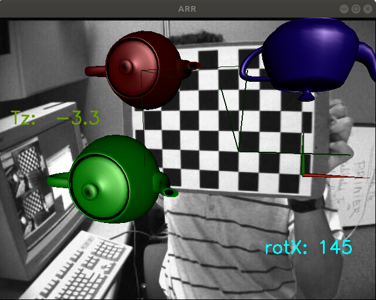

opencv + opengl = augmented reality

The python code `calibrate_ar.py` only shows that it is possible to use the opencv's internal camera matrix and the camera pose.

- OpenGL 1.x functions are used.
- TODO: OpenGL SL
- TODO: Globally moving the world plane so that the whole view can be seen from the side.

