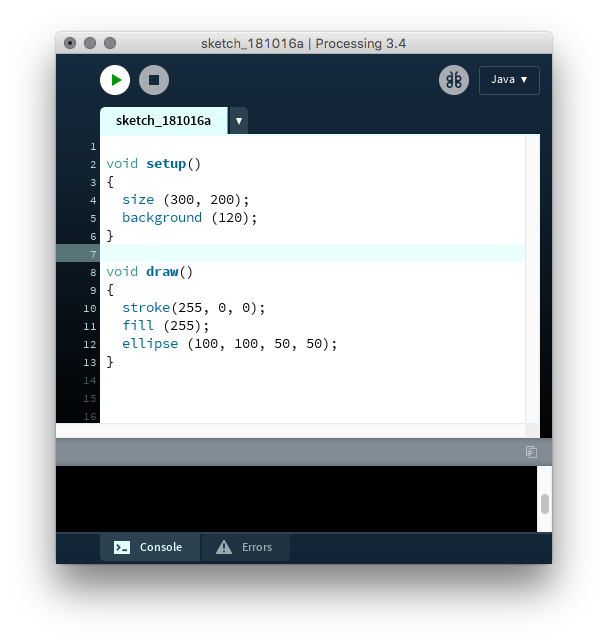
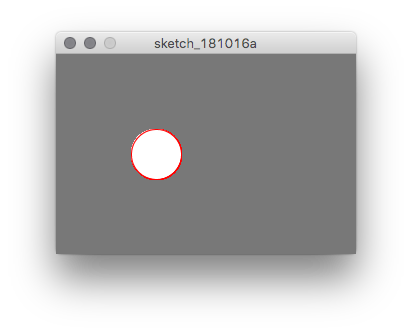

# First Contact with Processing 3 {#c1}

## Installation

* Visit [Processing3](www.processing.org), and download it. The downloaded package can be put anywhere you like. That's it.

## Draw a circle

Why a circle? It is just beautiful.

```{Rcpp, eval=FALSE}
void setup()
{
  size (300, 200);
  background (120);
}

void draw()
{
  stroke(255, 0, 0);
  fill (255);
  ellipse (100, 100, 50, 50);
}
```

The Processing window looks like this:
```{r, echo=FALSE, fig.align='center', fig.cap='Processing IDE'}

```

and the display window when I pressed the `Run` button is like this
```{r, echo=FALSE, fig.align='center', fig.cap='Run! The window shows the rendering result.'}

```

You need two functions `void setup()` & `void draw()`. Don't forget. 

- The `setup()` function runs only once
    - You **must** specify `size(width,height)` of the rendering window !! This is the start of your processing program.
- `draw()` runs repeatedly until you stop the program running.

Q. Go to Processing site and find & read the reference page ([here](https://processing.org/reference/)) for functions: 

1. `size()`
2. `background()`
3. `stroke()`
4. `fill()`
5. `ellipse()`

and 

1. `void setup()`
1. `void draw()`
