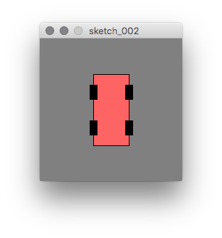
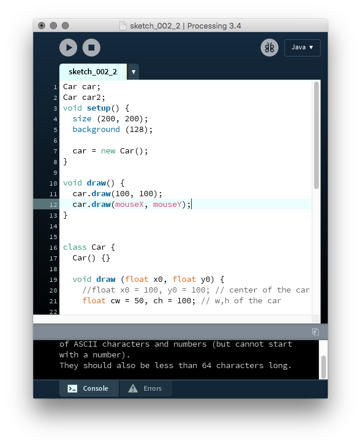
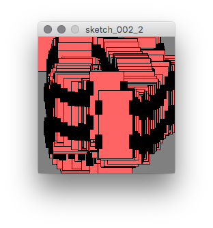

# A 2D Car  {#c2}


## 시작
옛날 비디오 게임에나 나올 듯한 엉성하기 짝이 없는 2차원 평면 자동차를 하나 그려보자.

```{Rcpp, eval=FALSE}
void setup() {
  size (200,200);
  background (128);
}

void draw() {
  float x0 = 100, y0 = 100; // center of the car
  float cw = 50, ch = 100; // w,h of the car
  
  // car body
  fill (255, 100, 100);
  rectMode (CENTER); // the rect() is w.r.t center
  rect(x0, y0, cw, ch);
  
  // now 4 wheels
  float ch4 = ch / 4; 
  float yfront = y0 - ch4; // front wheel
  float xfrontRight = x0 + cw/2;
  fill (0);
  rect (xfrontRight, yfront, 10, 20);
  
  float xfrontLeft = x0 - cw/2;
  rect (xfrontLeft, yfront, 10, 20);
  
  float yback = y0 + ch4;
  rect (xfrontRight, yback, 10,20);
  rect (xfrontLeft, yback, 10, 20);
}
```

How does it look like?
```{r, echo=FALSE, fig.align='center', fig.cap='아주 옛날 비디오 게임에 나오던 자동차.'}

```

Q. Change the numbers so that you have your own style of the car.

## 클래스로 만들자.

```{Rcpp, eval=FALSE}
Car car;

void setup() {
  size (200, 200);
  background (128);
  
  car = new Car();
}

void draw() {
  car.draw(100, 100);
}


class Car {
  Car() {}
  
  void draw (float x0, float y0) {
    //float x0 = 100, y0 = 100; // center of the car
    float cw = 50, ch = 100; // w,h of the car

    // car body
    fill (255, 100, 100);
    rectMode (CENTER); // the rect() is w.r.t center
    rect(x0, y0, cw, ch);

    // now 4 wheels
    float ch4 = ch / 4; 
    float yfront = y0 - ch4; // front wheel
    float xfrontRight = x0 + cw/2;
    fill (0);
    rect (xfrontRight, yfront, 10, 20);

    float xfrontLeft = x0 - cw/2;
    rect (xfrontLeft, yfront, 10, 20);

    float yback = y0 + ch4;
    rect (xfrontRight, yback, 10, 20);
    rect (xfrontLeft, yback, 10, 20);

    return;
  }
}
```

Now the code looks more concise! 코딩 좀 해봤으면 다 이렇게 해야하는거다.

- `Car` object 를 구성하는 `class` 는 아랫쪽에 만들어져 있다. 아랫쪽이 싫으면 위쪽에 만들어도 좋고, 그것도 싫으면 적당히 아무데나 만들면 된다.
- 맨 첫 줄에 선언한 `Car car;` 에서 variable `car` is simply a name, and its memory is not allocated until you give some space by `car = new Car;` in the `setup` function.
- The `Car` class has two member functions. One is the constructor `Car() {}` which did nothing. The other is `void draw(float x0, float y0)` that draws the car at the specified location in the display window.


## Random postion

Let's make another `Car` and put it somewhere randomly chosen in the window.

```{Rcpp, eval=FALSE}
Car car;
Car car2;

void setup() {
  size (200, 200);
  background (128);
  
  car = new Car();
  car2 = new Car();
}

void draw() {
  car.draw(100, 100);
  car2.draw (random (80,90), random(110,120));
}
```

- The position of the second car `car2` is determined randomly by the two function calls to `random(low, high)`. 
-The object `car2` is of course allocated in the setup function.
- The second car will move (or tremble) very quickly because it's position is changing every time the display window is drawn. How fast? Maybe 30 times per second.
- Sorry that I cannot show you the beautiful motion of my car.

## Car2 at Mouse Posiiton

```{Rcpp, eval=FALSE}
Car car;
Car car2;

void setup() {
  size (200, 200);
  background (128);
  
  car = new Car();
  car2 = new Car();
}

void draw() {
  car.draw(100, 100);
  car2.draw (mouseX, mouseY);
}
```

Q. Where are these `mouseX` and `mouseY` from?

Q. What else **system variables** can you find?


The Processing window looked like this. Note that the system variables were shown in red color automatically. The editor must have a setting inside.
```{r, echo=FALSE, fig.align='center', fig.cap='System variables appeared with red color in my computer'}

```

Now the second car `car2` moves according to the motion of my mouse pointer. 
Let's move it then.

```{r, echo=FALSE, fig.align='center', fig.cap='The car moves with mouse motion.'}

```

Q. If I don't want to see the overlap of car2's. What should be done?

Q. Can you set the color of the car when you allocate it in `setup()`? What do you need to change for such initialization in addition to computer memory allocation?

Q. Can you put the portion of class definition into a spearate file?