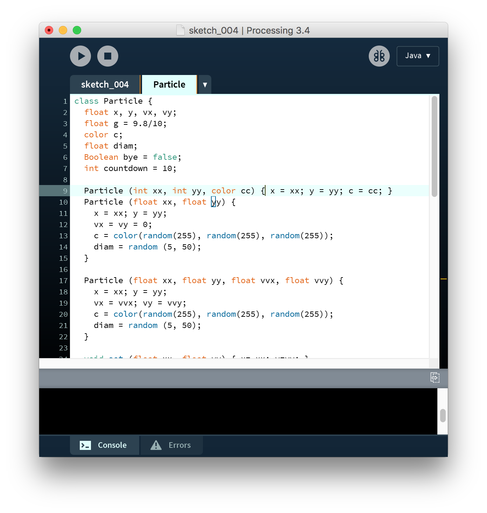
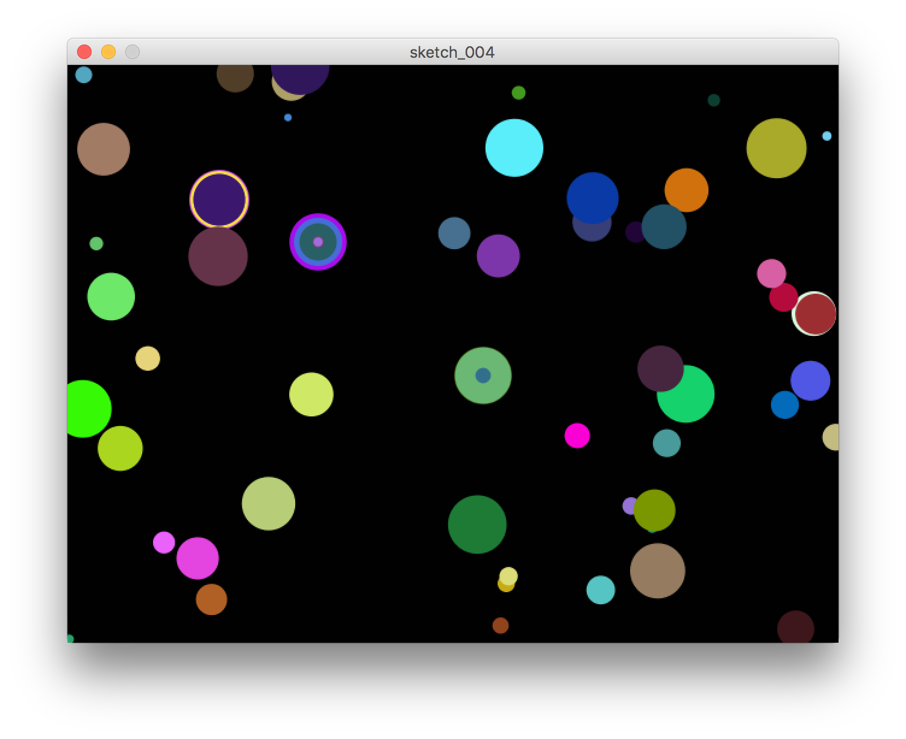

# Particles I

## Topics

* `sketch_004`
* Make a user defined object `class Particle`
    - These objects are treated in call-by-reference way.
    
* Using `ArrayList` for inserting, deleting, and accessing the elements of an array.
    - member functions
    - how to remove some elements: backward


## Source codes

We make an object called `Particle`.

```{Rcpp, eval=FALSE}
class Particle {
  float x, y, vx, vy;
  float g = 9.8/5;
  color c;
  float diam;
  Boolean bye = false;
  int countdown = 10;
  
  Particle (int xx, int yy, color cc) { x = xx; y = yy; c = cc; }
  Particle (float xx, float yy) {
    x = xx; y = yy;
    vx = vy = 0;
    c = color(random(255), random(255), random(255));
    diam = random (5, 50);
  }

  Particle (float xx, float yy, float vvx, float vvy) {
    x = xx; y = yy;
    vx = vvx; vy = vvy;
    c = color(random(255), random(255), random(255));
    diam = random (5, 50);
  }

  void set (float xx, float yy) { x= xx; y=yy; }
  void setx (float xx) { x = xx; }
  float x() { return x; }
  float y() { return y; }
  
  void draw() {
    noStroke();
    fill (c);
    ellipseMode (CENTER);
    ellipse (x,y, diam, diam);
  }
  
  void move() {
    x = x + vx;
    y = y + vy + 0.5*g;
    vy = vy + g;
    
    countdown = countdown - 1;
  }
  
  Boolean move(float ww, float wh) {
    move();
    if (y - diam/2 > wh) { bye = true; }
    return bye;
  }
  
  Boolean bye() { return bye; }
  int countdown() { return countdown; }
}
```

This is my main sketch for drawing.

```{Rcpp, eval=FALSE}
ArrayList<Particle> plist = new ArrayList<Particle> ();
ArrayList<Particle> flist = new ArrayList<Particle> ();
Boolean flag_move = false;

void setup() {
  size(640, 480);
   
  println ("plist size = ", plist.size());
  for (int i = 0; i < 50; i++)
    plist.add (new Particle (random(width), random(height)));
  println ("plist size = ", plist.size());
}

void draw() {
  background (1);
  for (Particle pi : plist) { pi.draw(); }
  
  if (flag_move == true) {
    for (int i = 0; i < plist.size(); i++) {
      Particle pi = plist.get(i);
      pi.move(width, height);
      if (pi.bye()) 
        plist.remove(i);
    }
  }
  
  for (int i = flist.size() - 1; i >= 0; i--) {
    Particle f = flist.get(i);
    f.draw();
    f.move();
    if (f.bye() || f.countdown() < 0) flist.remove (i);
  }
} // end draw()

void mousePressed() {
  if (mouseButton == LEFT) {
      make_fire_particles ();
  } else if (mouseButton == RIGHT) {
      flag_move = !flag_move;
  }
}

void make_fire_particles () {
  int N = 13;
  float vmag = 20 + random (10);
  for (int k = 0; k < N; k++) {
    float vx = vmag * cos (TWO_PI / N * k);
    float vy = vmag * sin (TWO_PI / N * k);
    Particle p = new Particle (mouseX, mouseY, vx, vy);
    flist.add (p);
  }
}
```


```{r, echo=FALSE, fig.align='center', fig.cap='The Processing3 IDE. The code for particle object is separated to a file.'}

```

## Visual Outputs

```{r, echo=FALSE, fig.align='center', fig.cap='A view of the drawing.'}

```

- If I press the mouse button, a firework will appear. 
- If the right mouse button is pressed, the circles shown initially in the drawing window will fall down to the bottom and disappear.