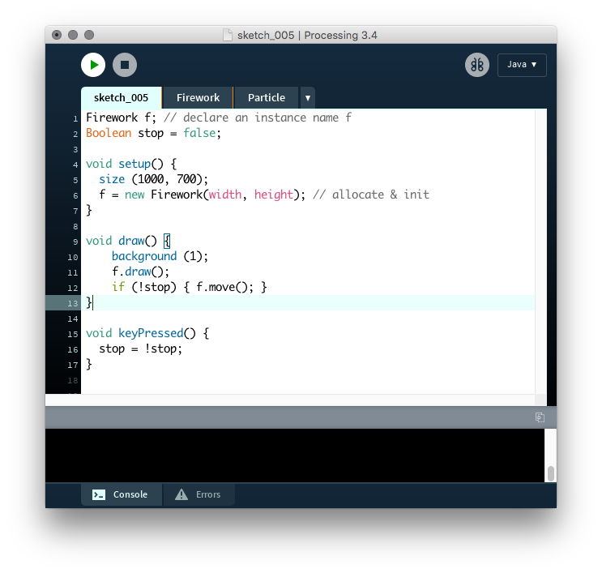
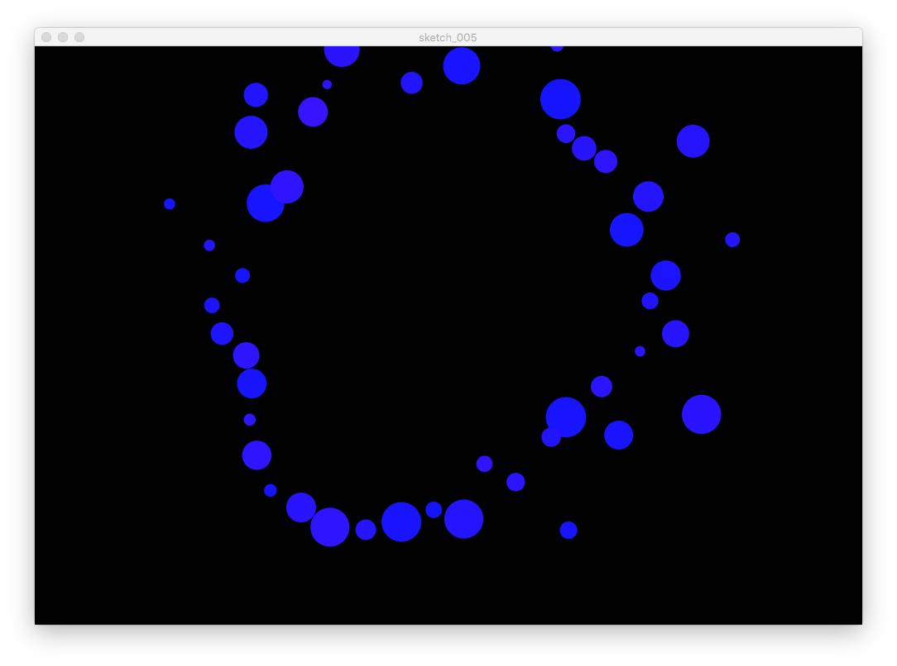

# Firework: Particle II  {#c5}

## Topics

- `sketch_005.pde`

- Any member variable can be directly accessed and changed when it is declared as `public`.

## Source codes

### Main Sktech
```{Rcpp, eval=FALSE}
Firework f; // declare an instance name f
Boolean stop = false;

void setup() {
  size (1000, 700);
  f = new Firework(width, height); // allocate & init
}

void draw() {
    background (1);
    f.draw();
    if (!stop) { f.move(); }
}

void keyPressed() {
  stop = !stop;
}
```

### Firework Class
```{Rcpp, eval=FALSE}
class Firework {
  float wwidth, wheight;
  Particle s;
  Boolean flagS = true; // s is drawn when this is true
  ArrayList<Particle> plist = new ArrayList<Particle>();

  Firework(int ww, int wh) {
    wwidth = ww; 
    wheight = wh;
    s = new Particle(ww/2, wh, 0, -25);
    s.setColor (color(255, 255, 255));
    s.setDiam (5);
  }

  void draw() {
    if (flagS) { s.draw(); }

    for (Particle p : plist) { p.draw(); }
  } // draw

  void move () {
      if (flagS) { s.move(wwidth, wheight); }
  
      for (Particle p : plist) { p.move(wwidth, wheight); }
  
      if (s.vy > -1 && flagS == true) {
          flagS = false;
          // generate firework
          make_fire_particles();
      }
  } // move

  void make_fire_particles () {
    int N = 50;
    for (int k = 0; k < N; k++) {
      float vmag = 10 + random (7,17);
      float vx = vmag * cos (TWO_PI / N * k);
      float vy = vmag * sin (TWO_PI / N * k);
      Particle p = new Particle (s.x, s.y, vx, vy);
      p.diam = random (10, 50);
      p.c = color (random(20,55), 20, 255);
      plist.add (p);
    }
  }
} // end class
```

### Particle Class
```{Rcpp, eval=FALSE}
class Particle {
  public float x, y, vx, vy;
  float g = 9.8/15;
  public color c;
  public float diam;
  public Boolean bye = false;
  public int countdown = 10 + int(random(10));
  
  Particle (int xx, int yy, color cc) { x = xx; y = yy; c = cc; }
  Particle (float xx, float yy) {
    x = xx; y = yy;
    vx = vy = 0;
    c = color(random(255), random(25), random(25));
    diam = random (5, 10);
  }

  Particle (float xx, float yy, float vvx, float vvy) {
    x = xx; y = yy;
    vx = vvx; vy = vvy;
    c = color(random(255), random(25), random(25));
    diam = random (5, 10);
  }
 
  void draw() {
    noStroke();
    fill (c);
    ellipseMode (CENTER);
    ellipse (x,y, diam, diam);
  }
  
  void move() {
    x = x + vx;
    y = y + vy + 0.5*g;
    vy = vy + g;
    
    countdown = countdown - 1;
  }
  
  Boolean move(float ww, float wh) {
    move();
    if (y - diam/2 > wh) { bye = true; }
    return bye;
  }
  
  Boolean bye() { return bye; }
  int countdown() { return countdown; }
  void setColor(color cc) { c=cc; }
  void setDiam(float d) { diam=d; }
}
```

## Visual Outputs

```{r, echo=FALSE, fig.align='center', fig.cap='A view of the sketch IDE.'}

```

```{r, echo=FALSE, fig.align='center', fig.cap='A view of the drawing.'}

```

## Summary

Q. Add a fancy tail when the fire ball goes up.

Q. Add fancy tails to the fire particles after explosion.

Q. Add the moon and several stars twinkling so that the background looks like a sky.


<!-- EOF -->