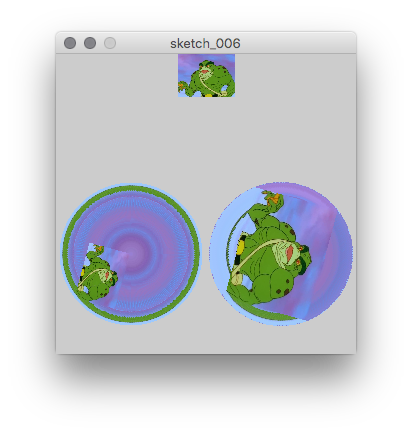

# Load and Image & Rotate It

- `PImage`
- `loadImage()`
- `image()`
- `pushMatrix()`, `popMatrix()`
- `rotate()`, `translate()`, `scale()`

## TODOs

1. load an image file into Processing memory
1. place a copy of it at the top cener.
1. rotate it w.r.t the left top corner of the image.
1. rotate it w.r.t the center of the image.

## Example code

```{Rcpp, eval=FALSE}
PImage im; // Processing Image Class

void setup () {
  size (300, 300);
  im = loadImage ("data/Frog-Man2.jpg");
}

float radian = 0;
float rstep = PI / 100;

void draw () {
  // image at the center
  image (im, width/2 - im.width/10/2, 0, im.width/10, im.height/10);
  
  pushMatrix();
    translate (width/4, height*2/3.);
    rotate (radian);
    image (im, 0, 0, im.width/10, im.height/10);
  popMatrix();
  
  pushMatrix();
    translate (width*3/4., height*2/3.);
    rotate (radian);
    scale (0.2); // scale's pin point is the origin
    translate (-im.width/2, -im.height/2);
    image (im, 0, 0);
  popMatrix();
  
  radian += rstep;
}
```


```{r, echo=FALSE, fig.align='center', fig.cap='A screenshot of the view of one frog-man, two rotating for-mans.', out.width='70%'}

```

## Extensions

What else motion do you want?
