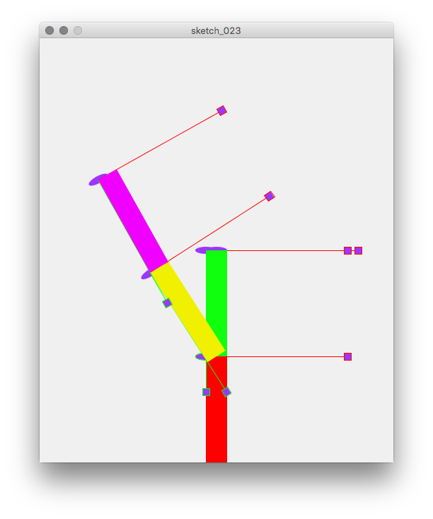

# Inverted Pendulum sticks {#c23}

## Topics

- `sketch_023.pde`

- Random branching with two possibilities.
- Using geometric transformation to make a shape: `pushMatrix()` & `popMatrix()`

## Source codes

### Main Sktech

```{Rcpp, eval=FALSE}
float w = 30;
float h = 150;

void drawbar(int c) {
    noStroke ();
    fill (c);
    rect (0,0,w,h);
}

void drawAxis() {
  fill (155,55,255); ellipseMode (CENTER); ellipse(0,0,30,10);

  stroke (0xFFFF0000);
  line (0,0,200,0);
  rect (200-5, -5, 10, 10);
  
  stroke (0xFF00FF00);
  line (0,0,0,200);
  rect (-5,200-5,10,10);
}

void setup() {
  size (500, 600);
}

void draw () {
  background (0xFFf0f0f0);
  translate (width/2, height/2);
  drawAxis();

  translate (-w/2, height/2 - h);
  drawAxis();
  drawbar(0xFFFF0000);

  translate (w/2, 0);
  translate (0, -h);
  translate (-w/2, 0);
  drawAxis();
  drawbar (0xFF0fFF0f);
  
  translate (w/2, h);
  rotate(radians(50 * sin(TWO_PI/5000 * millis())));
  translate (0, -h);
  translate (-w/2, 0);
  drawAxis();
  drawbar(0xFFF0F000);

  translate (w/2, 0);
  rotate(radians(25*sin(TWO_PI/3000. * millis())));
  translate (0, -h);
  translate (-w/2, 0);
  drawAxis();
  drawbar(0xFFF000FF);
}
```


## Visual Outputs

```{r fig022, echo=FALSE, fig.align='center', fig.cap='Three bars swaying.'}

```

## Summary


Q. Drwa coordiante axes on the rotation joint. The code above has two joints.
    


<!-- EOF -->
