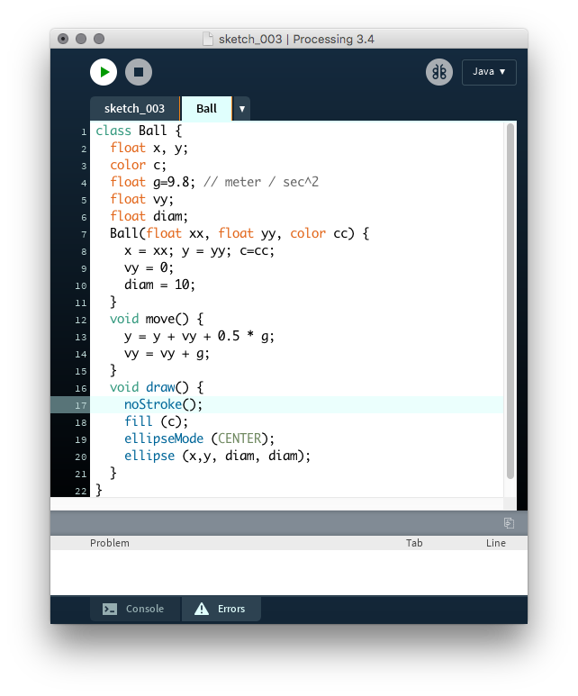
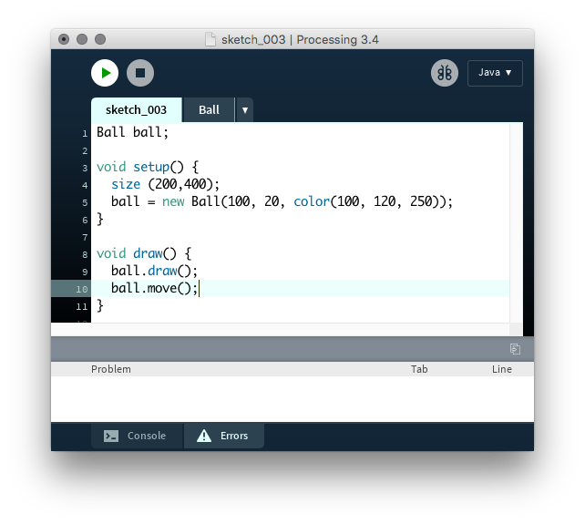
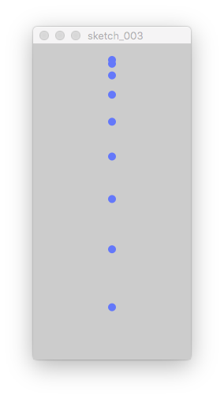

# Bouncing Balls {#ball}

You must have heard of Newton's physics of a falling body. Then an object falls with gravity acceleration $g$, with initial velocity $v_0$, then its position $y$ after some time elapse $t$ is given by

\begin{align}
    y(t) & = y_0 + v_0 t + \frac{1}{2} g t^2 \\
    v(t) & = v_0 t + g t
\end{align}


    전혀 들어본적도 없다구요? 상관없습니다. 요즘이 어떤 시대인데 이런 걸 이해gk려고 노력할까요. 그냥 가져다 씁시다.
    


## Free fall ball
일단은 그냥 자유낙하 하는 원을 하나 그려보자. 복잡하게 시작해봐야 에러만 많을 뿐이다.

- `Ball` class 는 따로 파일을 만들자. 아래 그림과 같이 Processing IDE에서 탭을 만들면 된다.
그리고 아래 그림과 같이 소스코드를 작성하자.

```{r, echo=FALSE, fig.align='center', fig.cap='Ball class in a new tab in Processing3.'}

```

Main function that I made is here. Since the ball class is in another file, it looks very concise and minimal.

```{r, echo=FALSE, fig.align='center', fig.cap='Main part of our Processing3 project.'}

```

Then the drawing will show you the falling ball, which would fall very quickly, like the following image.

```{r, echo=FALSE, fig.align='center', fig.cap='Drawing of a free falling ball with gravitational acceleration.'}

```

Why did it not bounce? Of course, we have not made any code for it.

## Free fall and bouncing

OK, let's make it bounce.