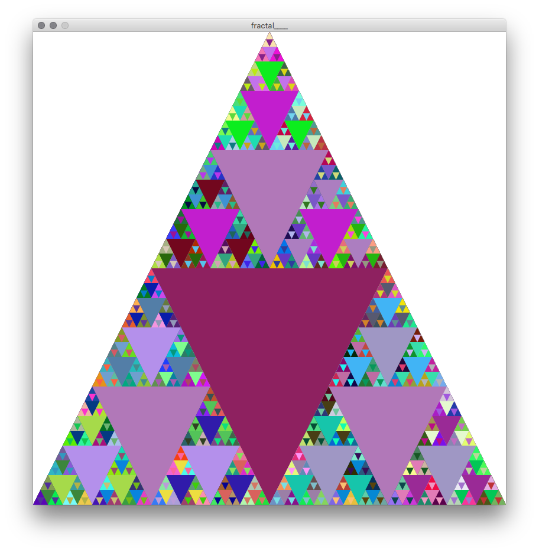
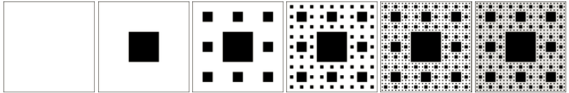

# Sierpinski Triangle

```{Rcpp, eval=FALSE}
//Sierpiński triangle

int N = 5;

void setup() {
  size(800, 800);
  background(255);
  frameRate (1);
}

void draw() {
  smooth();
  noStroke();
  triangleSier(0, 800, 400, 0, 800, 800, N, 
               color(random(255), random(255), random(255)));
}

void triangleSier(float x1, float y1, float x2, float y2, float x3, float y3, 
                  int n, color c) {
  if ( n > 0 ) {   
    fill (c);
    triangle(x1, y1, x2, y2, x3, y3);
    
    float h1 = (x1+x2)/2.0;
    float w1 = (y1+y2)/2.0;
    float h2 = (x2+x3)/2.0;
    float w2 = (y2+y3)/2.0;
    float h3 = (x3+x1)/2.0;
    float w3 = (y3+y1)/2.0;
    
    c = color(random(255), random(255), random(255));
    triangleSier(x1, y1, h1, w1, h3, w3, n-1, c);
    triangleSier(h1, w1, x2, y2, h2, w2, n-1, c);
    triangleSier(h3, w3, h2, w2, x3, y3, n-1, c);
  }
}
}
```


```{r Sierpinski3, echo=FALSE, fig.align='center', fig.cap='Sierpinski Triangle.', out.width='70%'}

```

## Extensions

Q. Draw a Sierpinski Carpet. Image from [here](https://www.101computing.net/python-fractals/)

```{r SierpinskiCarpet, echo=FALSE, fig.align='center', fig.cap='Sierpinski Carpet', out.width='70%'}

```
