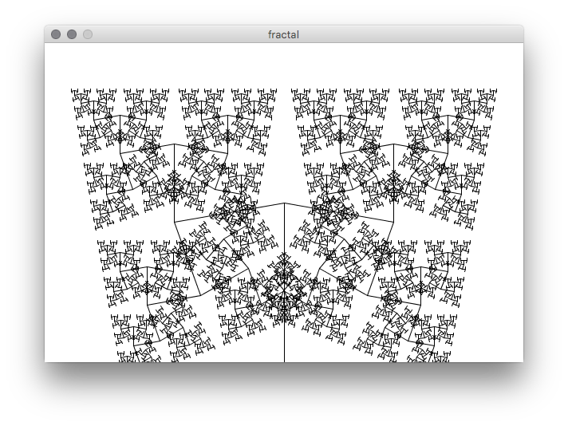
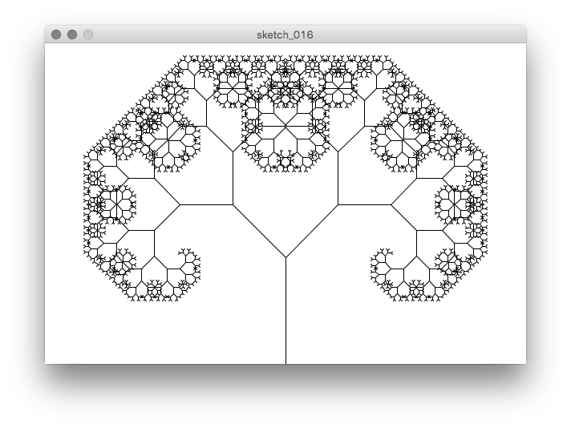

# Fractal + Geometry

```{Rcpp, eval=FALSE}
float theta;
float t;
float ratio = 0.67;

void setup() {
  size(600,400);
  theta = PI/5.5; //1.8;
  t = height/3;
}

void draw(){
  background(255);
  stroke(0);
  translate(width/2,height);
  line(0,0,0,-t);
  translate(0,-t);
  branch(t);
}

void branch(float h) {
  h = h * ratio;
  if(h > 2) {
      pushMatrix();
      rotate(theta);
      line(0,0,0,-h);
      translate(0,-h);
      branch(h);
      popMatrix();
      
      pushMatrix();
      rotate(-theta);
      line(0,0,0,-h);
      translate(0,-h);
      branch(h);
      popMatrix();
  }
}
```


```{r fractalGeo, echo=FALSE, fig.align='center', fig.cap='A Fractal image', out.width='70%'}

```

## Extensions

Q. Change `theta` , `ratio`, `t` to generate a new view of your style. Below is an example with a different set of parameters (but using the same code).

```{r SierpinskiCarpet, echo=FALSE, fig.align='center', fig.cap='theta=PI/1.8', out.width='70%'}

```
