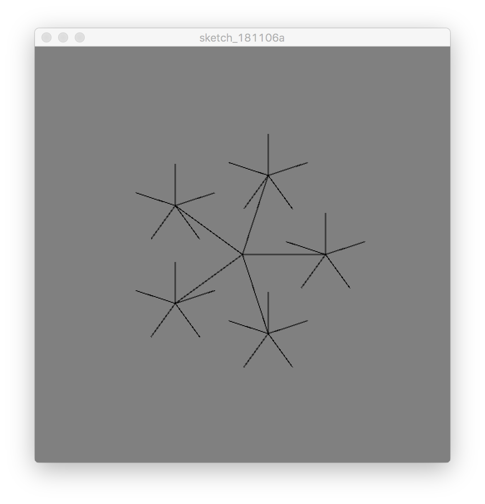

# A rotating shape {#c21}

## Topics

- `sketch_021.pde`

- Using geometric transformation to make a shape: `pushMatrix()` & `popMatrix()`

## Source codes

### Main Sktech
```{Rcpp, eval=FALSE}
/*
*   Drawing a rotating star.
*   1. push/pop Matrix
*   2. scale
*   3. rotate
*   4. Q. can you rotate the shape with millis(), with period of 2 seconds
*/

int N = 5;

class Shape {
  float r = 1;
  Shape (int NN) { N = NN; }
  void draw(float scale) {
    for (int i = 0; i < N; i++) {
        float x = r * cos (i*TWO_PI/N);
        float y = r * sin (i*TWO_PI/N);
        strokeWeight (1./scale);
        line (0,0, x, y);
    }
  }
};

Shape star = new Shape(N);

void setup () {
  size (500,500, P3D);
  smooth ();
  frameRate (10);
}

float rotangle = 0;

void draw() {
  background (128);
  translate (width/2, height/2);
  
  float r = 100;
  pushMatrix();
  scale (r); // scales everything
  star.draw(r);
  popMatrix();
  for (int i = 0; i < N; i++) {
    pushMatrix();
        float rad = i*TWO_PI/N;
        rotate (rad);
        translate (r, 0, 0);
        pushMatrix();
            float scaleValue = r/2;
            scale (scaleValue);
            rotate (radians(rotangle));
            star.draw (scaleValue);
        popMatrix();
    popMatrix();
  }
  
  rotangle += 9;
}
```


## Visual Outputs

```{r fig021, echo=FALSE, fig.align='center', fig.cap='A shot of rotating shapes. The five small shapes are rotating.'}

```

## Summary

- Remember that the `scale()` function in Processing3 scales everything including the `strokeWeight`. Not every graphics library will act the same way. It is just a choice of Processing3.

Q. Rotate the shape at the center with period of 5 seconds. Use `millis()`.

Q. Make the small shapes have different rotation rates.

Q. Add another object/shape to decorate it.
    
   - Can you put a rounding shape around the whole perimeter?


<!-- EOF -->