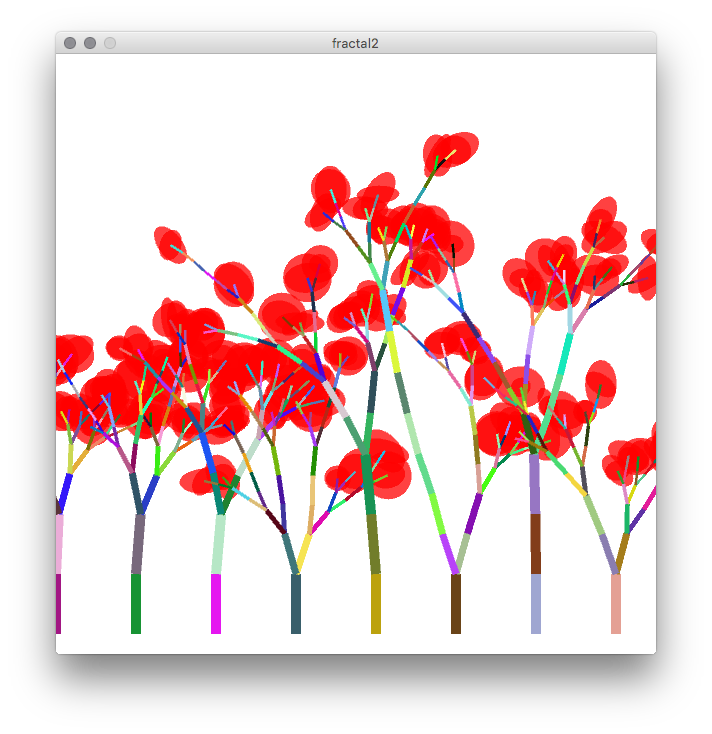

# A Fractal Tree {#c22}

## Topics

- `sketch_022.pde`

- Random branching with two possibilities.
- Using geometric transformation to make a shape: `pushMatrix()` & `popMatrix()`

## Source codes

### Main Sktech

```{Rcpp, eval=FALSE}
void setup() {
  size(600, 600, P3D);
  smooth();
  noLoop();
}

void draw() {
    background(255);
    strokeWeight(10);
  
    for (int i = -300; i<= 300; i += 80) {
        pushMatrix();
    //    translate(width/2+i, height-20, 0);
        translate(width/2+i, height-20, 0);
        branch(0);
        popMatrix();
    }
}

void branch(int depth) {
    if (depth < 5) {
        stroke(random(255), random(255), random(255));
        line(0, 0, 0, -height/10);
    
        translate(0, -height/10);
        rotate(random(-0.1, 0.1));
  
        if (random(1.0) < 0.6) { // double branch
              rotate(0.3); // ㄱㅏㅈㅣ ㅂㅓㄹㅇㅓㅈㅣㅁ
              scale(0.7);  // ㄱㅏㅈㅣ ㄱㅣㄹㅇㅣ ㅈㅜㄹㅇㅓㄷㅡㅁ
              pushMatrix();
              branch(depth+1); // ㄱㅏㅈㅣ ㄱㅡㄹㅣㄱㅣ
              popMatrix();
              rotate(-0.6); // ㅂㅏㄴㄷㅐㅉㅗㄱㅇㅔ ㄱㅏㅈㅣ ㅂㅓㄹㅇㅓㅈㅣㅁ 
              pushMatrix();
              branch(depth+1); // ㄱㅏㅈㅣ ㄱㅡㄹㅣㄱㅣ
              popMatrix();
          } else {
              branch(depth); // ㄱㅏㅈㅣ ㄱㅡㄹㅣㄱㅣ  single branch
          }
    } 
    else {
        noStroke();
        fill(#FF0000, 190); //#FFBFF9, 150);
        ellipse(0, 0, random(100, 300), random(100, 300));
        stroke(0);
        println ("ellipse");
    }
}

void mouseReleased() {
    redraw();
}
```


## Visual Outputs

```{r fig022, echo=FALSE, fig.align='center', fig.cap='Trees generated by a repetition of simple operations.'}

```

## Summary


Q. Change the color of leaves.

Q. Change the depth.

    


<!-- EOF -->
