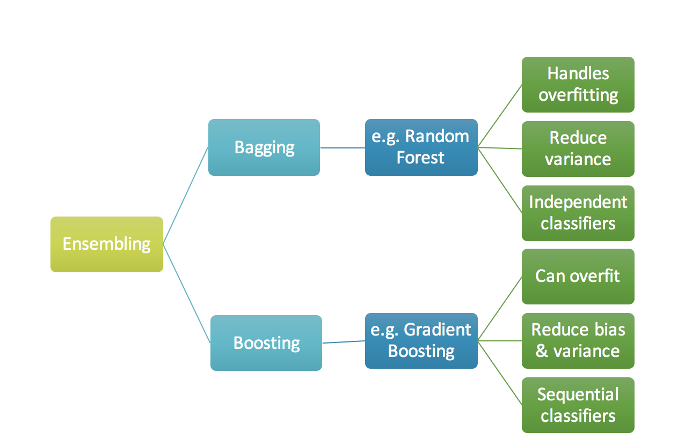
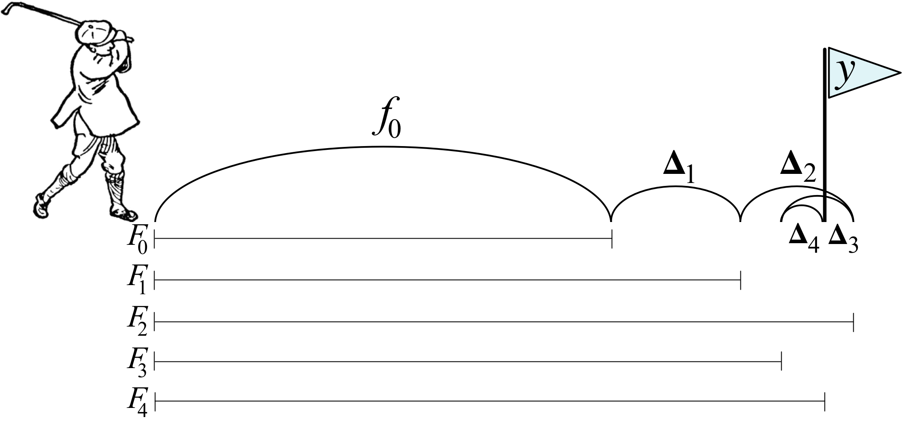

# Gradient Boosting

## Useful links to read

1. [Gradient Boosting from scratch](https://medium.com/mlreview/gradient-boosting-from-scratch-1e317ae4587d)

1. [How to explain gradient boosting by Terence Parr and Jeremy Howard](http://explained.ai/gradient-boosting/index.html)

1. [What is the difference between Bagging and Boosting](https://quantdare.com/what-is-the-difference-between-bagging-and-boosting/)

1. [Gradient boosting machines (GBM), A Tutorial](https://www.ncbi.nlm.nih.gov/pmc/articles/PMC3885826/)

1. Use [XGBoost](https://xgboost.ai/).


## Gradient Boosting from Scratch

The reason we use ensembles is that many different predictors trying to predict same target variable will perform a better job than any single predictor alone.

```{r ensembling, echo=FALSE, fig.align='center', fig.cap="Two branches of ensemble-based learning", cache=FALSE, out.width='70%'}

```

Ensembling techniques are further classified into Bagging and Boosting.

1. **Bagging** is a simple ensembling technique in which we build many independent predictors/models/learners and combine them using some model averaging techniques. (e.g. weighted average, majority vote or normal average). 
We typically take random sub-sample/bootstrap of data for each model, so that all the models are little different from each other. Each observation is chosen with replacement to be used as input for each of the model. So, each model will have different observations based on the bootstrap process. Because this technique takes many uncorrelated learners to make a final model, it reduces error by reducing variance. Example of bagging ensemble is Random Forest models.

1. **Boosting** is an ensemble technique in which the predictors are not made independently, but sequentially.
This technique employs the logic in which the subsequent predictors learn from the mistakes of the previous predictors. Therefore, the observations have an unequal probability of appearing in subsequent models and ones with the highest error appear most. (So the observations are not chosen based on the bootstrap process, but based on the error). The predictors can be chosen from a range of models like decision trees, regressors, classifiers etc. Because new predictors are learning from mistakes committed by previous predictors, it takes less time/iterations to reach close to actual predictions. But we have to choose the stopping criteria carefully or it could lead to overfitting on training data. Gradient Boosting is an example of boosting algorithm.


```{r bagging-boosting, echo=FALSE, fig.align='center', fig.cap="Bagging (independent models), Boosting (sequential models)", cache=FALSE, out.width='80%'}

```


## [How to explain gradient boosting by Terence Parr and Jeremy Howard](http://explained.ai/gradient-boosting/index.html)

Gradient boosting machines (GBMs) are currently very popular and so it's a good idea for machine learning practitioners to understand how GBMs work. The problem is that understanding all of the mathematical machinery is tricky and, unfortunately, these details are needed to tune the hyper-parameters. (Tuning the hyper-parameters is required to get a decent GBM model unlike, say, Random Forests.) Our goal in this article is to explain the intuition behind gradient boosting, provide visualizations for model construction, explain the mathematics as simply as possible, and answer thorny questions such as why GBM is performing “gradient descent in function space.” 

```{r golf-dir-vector, echo=FALSE, fig.align='center', fig.cap="Bagging (independent models), Boosting (sequential models)", cache=FALSE, out.width='80%'}

```

**The intuition behind gradient boosting**

To construct a boosted regression model, let's start by creating a crappy model, , that predicts an initial approximation of y given feature vector . Then, let's gradually nudge the overall model towards the known target value y by adding one or more tweaks, :

\begin{eqnarray*}
\hat y & = & f_0(\vec x) + \Delta_1(\vec x) + \Delta_2(\vec x) + ...  +  \Delta_M(\vec x) \\
 & = & f_0(\vec x) + \sum_{m=1}^M  \Delta_m(\vec x)\\
 & = & F_M(\vec x)\\
\end{eqnarray*}

Or, using a recurrence relation, let:

\begin{eqnarray*}
F_0(\vec x) &=& f_0(\vec x)\\
F_m(\vec x) &=& F_{m-1}(\vec x) + \Delta_m(\vec x)\\
\end{eqnarray*}


Keep reading in [explained.ai](http://explained.ai/gradient-boosting/L2-loss.html), which explains best.

## [What is the difference between Bagging and Boosting](https://quantdare.com/what-is-the-difference-between-bagging-and-boosting/)

Bagging and Boosting are both ensemble methods in Machine Learning, but what’s the key behind them?

Bagging and Boosting are similar in that they are both ensemble techniques, where a set of weak learners are combined to create a strong learner that obtains better performance than a single one. So, let’s start from the beginning:

What is an ensemble method?
Ensemble is a Machine Learning concept in which the idea is to train multiple models using the same learning algorithm. The ensembles take part in a bigger group of methods, called multiclassifiers, where a set of hundreds or thousands of learners with a common objective are fused together to solve the problem.

The second group of multiclassifiers contain the hybrid methods. They use a set of learners too, but they can be trained using different learning techniques. Stacking is the most well-known. If you want to learn more about Stacking, you can read my previous post, “Dream team combining classifiers“.

The main causes of error in learning are due to noise, bias and variance. Ensemble helps to minimize these factors. These methods are designed to improve the stability and the accuracy of Machine Learning algorithms. Combinations of multiple classifiers decrease variance, especially in the case of unstable classifiers, and may produce a more reliable classification than a single classifier.

To use Bagging or Boosting you must select a base learner algorithm. For example, if we choose a classification tree, Bagging and Boosting would consist of a pool of trees as big as we want. Single Bagging and Boosting 1 learner N learners From 1 to N Algorithm Comparison Versus

How do Bagging and Boosting get N learners?
Bagging and Boosting get N learners by generating additional data in the training stage. N new training data sets are produced by random sampling with replacement from the original set. By sampling with replacement some observations may be repeated in each new training data set.

In the case of Bagging, any element has the same probability to appear in a new data set. However, for Boosting the observations are weighted and therefore some of them will take part in the new sets more often: Single Bagging and Boosting Training set Multiple sets Random sampling with replacement Over weighted data Algorithm Comparison VersusThese multiple sets are used to train the same learner algorithm and therefore different classifiers are produced.

Why are the data elements weighted?
At this point, we begin to deal with the main difference between the two methods. While the training stage is parallel for Bagging (i.e., each model is built independently), Boosting builds the new learner in a sequential way: Single Bagging and Boosting Parallel Sequential Algorithm Comparison VersusIn Boosting algorithms each classifier is trained on data, taking into account the previous classifiers’ success. After each training step, the weights are redistributed. Misclassified data increases its weights to emphasise the most difficult cases. In this way, subsequent learners will focus on them during their training.

How does the classification stage work?
To predict the class of new data we only need to apply the N learners to the new observations. In Bagging the result is obtained by averaging the responses of the N learners (or majority vote). However, Boosting assigns a second set of weights, this time for the N classifiers, in order to take a weighted average of their estimates. Single Bagging and Boosting Single estimate Simple average Weighted average Algorithm Comparison VersusIn the Boosting training stage, the algorithm allocates weights to each resulting model. A learner with good a classification result on the training data will be assigned a higher weight than a poor one. So when evaluating a new learner, Boosting needs to keep track of learners’ errors, too. Let’s see the differences in the procedures: Single Bagging and Boosting Training stage Train and keep Train and evaluate Update sample weights Update learners weights Algorithm Comparison Versus

Some of the Boosting techniques include an extra-condition to keep or discard a single learner. For example, in AdaBoost, the most renowned, an error less than 50% is required to maintain the model; otherwise, the iteration is repeated until achieving a learner better than a random guess.

The previous image shows the general process of a Boosting method, but several alternatives exist with different ways to determine the weights to use in the next training step and in the classification stage. Click here if you like to go into detail: AdaBoost, LPBoost, XGBoost, GradientBoost, BrownBoost.

Which is the best, Bagging or Boosting?
There’s not an outright winner; it depends on the data, the simulation and the circumstances.
Bagging and Boosting decrease the variance of your single estimate as they combine several estimates from different models. So the result may be a model with higher stability.

If the problem is that the single model gets a very low performance, Bagging will rarely get a better bias. However, Boosting could generate a combined model with lower errors as it optimises the advantages and reduces pitfalls of the single model.

By contrast, if the difficulty of the single model is over-fitting, then Bagging is the best option. Boosting for its part doesn’t help to avoid over-fitting; in fact, this technique is faced with this problem itself. For this reason, Bagging is effective more often than Boosting.

To sum up:
Similarities

Differences

Both are ensemble methods to get N learners from 1 learner…

… but, while they are built independently for Bagging, Boosting tries to add new models that do well where previous models fail.

Both generate several training data sets by random sampling…

… but only Boosting determines weights for the data to tip the scales in favor of the most difficult cases.

Both make the final decision by averaging  the N learners (or taking the majority of them)…

… but it is an equally weighted average for Bagging and a weighted average for Boosting, more weight to those with better performance on training data.

Both are good at reducing variance and provide higher stability…

… but only Boosting tries to reduce bias. On the other hand, Bagging may solve the over-fitting problem, while Boosting can increase it.


# Introduction {#intro}

You can label chapter and section titles using `{#label}` after them, e.g., we can reference Chapter \@ref(intro). If you do not manually label them, there will be automatic labels anyway, e.g., Chapter \@ref(methods).

Figures and tables with captions will be placed in `figure` and `table` environments, respectively.

```{r nice-fig, fig.cap='Here is a nice figure!', out.width='80%', fig.asp=.75, fig.align='center'}
par(mar = c(4, 4, .1, .1))
plot(pressure, type = 'b', pch = 19)
```

Reference a figure by its code chunk label with the `fig:` prefix, e.g., see Figure \@ref(fig:nice-fig). Similarly, you can reference tables generated from `knitr::kable()`, e.g., see Table \@ref(tab:nice-tab).

```{r nice-tab, tidy=FALSE}
knitr::kable(
  head(iris, 20), caption = 'Here is a nice table!',
  booktabs = TRUE
)
```

You can write citations, too. For example, we are using the **bookdown** package [@R-bookdown] in this sample book, which was built on top of R Markdown and **knitr** [@xie2015].
