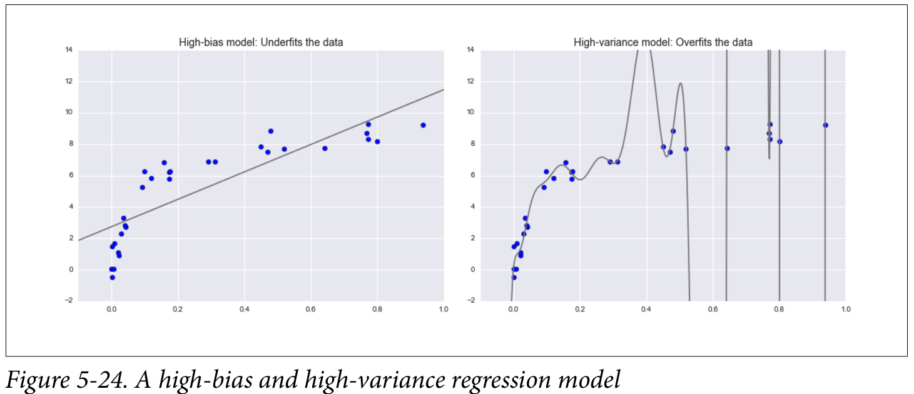
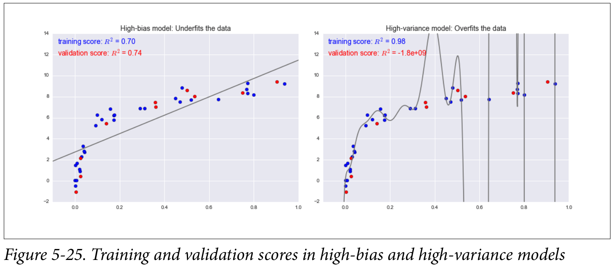
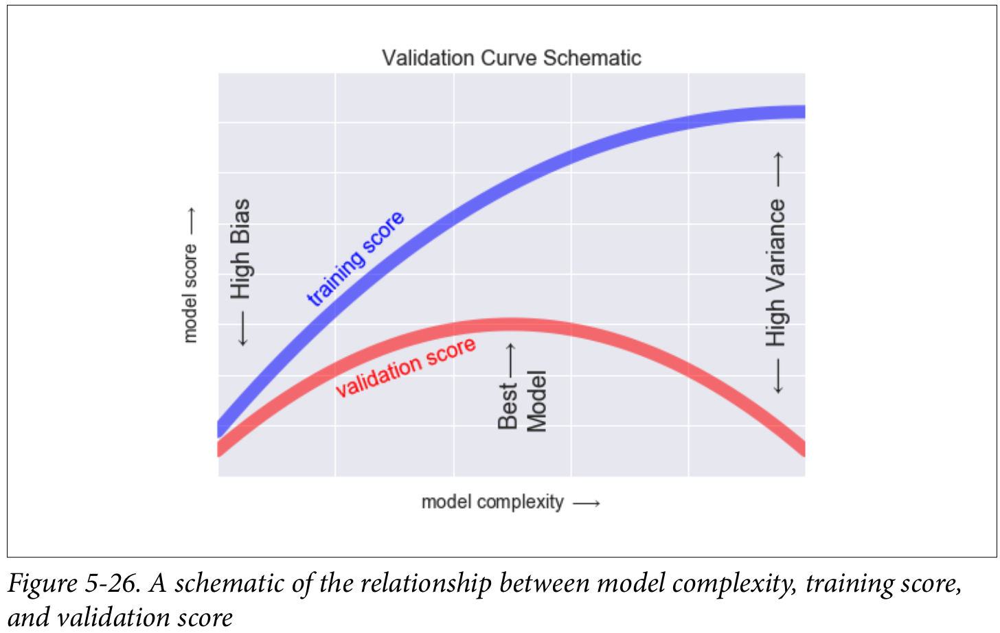

# The Bias-Variance trade-off 

This part is copied from [@pythonDataScienceHandBook].


Fundamentally, the question of “the best model” is about finding a sweet spot in the trade-off between bias and variance. Consider Figure 5-24, which presents two regression fits to the same dataset.

``` {r, echo=FALSE}

```

Figure 5-24. A high-bias and high-variance regression model

It is clear that neither of these models is a particularly good fit to the data, but they fail in different ways.

The model on the left attempts to find a straight-line fit through the data. Because the data are intrinsically more complicated than a straight line, the straight-line model will never be able to describe this dataset well. Such a model is said to __underfit__ the data; that is, it does not have enough model flexibility to suitably account for all the features in the data. Another way of saying this is that the model has **high bias**.

The model on the right attempts to fit a high-order polynomial through the data. Here the model fit has enough flexibility to nearly perfectly account for the fine fea‐ tures in the data, but even though it very accurately describes the training data, its precise form seems to be more reflective of the particular noise properties of the data rather than the intrinsic properties of whatever process generated that data. Such a model is said to __overfit__ the data; that is, it has so much model flexibility that the model ends up accounting for random errors as well as the underlying data distribution. Another way of saying this is that the model has **high variance**.

To look at this in another light, consider what happens if we use these two models to predict the y-value for some new data. In diagrams in Figure 5-25, the red/lighter points indicate data that is omitted from the training set.


``` {r, echo=FALSE}

```


The score here is the R2 score, or coefficient of determination, which measures how well a model performs relative to a simple mean of the target values. $R^2 = 1$ indicates
a perfect match, $R^2 = 0$ indicates the model does no better than simply taking the mean of the data, and negative values mean even worse models. From the scores associated with these two models, we can make an observation that holds more generally:

- For high-bias models, the performance of the model on the validation set is similar to the performance on the training set.
- For high-variance models, the performance of the model on the validation set is far worse than the performance on the training set.

If we imagine that we have some ability to tune the model complexity, we would expect the training score and validation score to behave as illustrated in Figure 5-26.

The diagram shown in Figure 5-26 is often called a validation curve, and we see the following essential features:

- The training score is everywhere higher than the validation score. This is gener‐ ally the case: the model will be a better fit to data it has seen than to data it has not seen.
- For very low model complexity (a high-bias model), the training data is underfit, which means that the model is a poor predictor both for the training data and for any previously unseen data.
- For very high model complexity (a high-variance model), the training data is overfit, which means that the model predicts the training data very well, but fails for any previously unseen data.
- For some intermediate value, the validation curve has a maximum. This level of complexity indicates a suitable trade-off between bias and variance.


``` {r, echo=FALSE}

```

