# CTC Connectionist Temporal Classification

- [Connectionist Temporal Classification: Labelling Unsegmented Sequence Data with RNNs, Alex Grave, et. al., ICML 2006](http://www.cs.toronto.edu/~graves/icml_2006.pdf)

- Taken from [Speech recognition](https://medium.com/@jongdae.lim/%EA%B8%B0%EA%B3%84-%ED%95%99%EC%8A%B5-machine-learning-%EC%9D%80-%EC%A6%90%EA%B2%81%EB%8B%A4-part-6-eb0ed6b0ed1d)

- [An intuitive explanation of Connectionist Temporal Classification](https://towardsdatascience.com/intuitively-understanding-connectionist-temporal-classification-3797e43a86c)

- [Sequence Modeling with CTC (more in-depth, mathematical)](https://distill.pub/2017/ctc/)
    Should be checked!
    
## Why CTC

- It is time consuming and boring to annotate a data-set on character-level.
- Variable length output

```{r ctcWhy, echo=FALSE, fig.align='center', fig.cap='Why Connectionist Temporal Classification'}
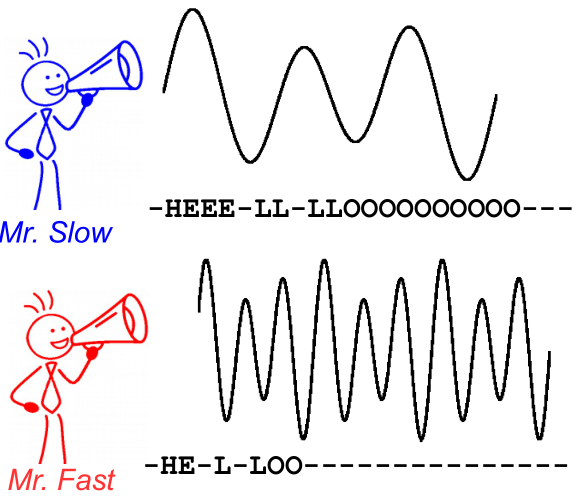
```


## How CTC works

- Supervised learning.

- The NN-training will be guided by the CTC loss function. We only ffed the output matrix of the NN and the corresponding GT text to the CTC loss function.

- CTC tries all possible alignments of the GT text in the image (or speech) and takes the sum of all scores. The score is high if the sum over the alignment-scores has a high value.


### Encoding the text

- Special character '-' (called blank here) is used.
1. When encoding a text, inserted are arbitrary many blank at any position. They are removed during decoding.
1. We must insert a blank between duplicate characters like in 'hello'.
1. We can repeat each character as often as we like

- examples:
    - 'to' : '---ttttoo', '-t-o-', 'to--', 'too', 'ttoo', 'tt-oo'
    - 'too' : ' --tttoooo-ooo--', 'to-o', 't-o-o', 'to---ooo'
    
* The NN is trained to yield an encoded text!

### Loss calculation

- Loss is calculated given an NN output (an encoded text) and GT text.

- Assume a small world of two characters {a, b}; including '-', it becomes three character world {a, b, -}.
- The RNN model may produce any sequence of the three characters.
    - In Fig. \@ref(fig:ctcLossCalc), each of the three characters has its own probability of realization.
    
```{r ctcLossCalc, echo=FALSE, fig.align='center', fig.cap='Outputs of RNN.'}
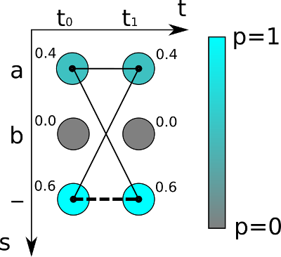
```

- Let's assume the GT text is 'a'. We have to calculate all possible paths of length 2 (because the output of RNN's is of length 2), which are {'aa', '-a', 'a-'}. The probabilities are {$0.4\times0.4$, $0.6\times0.4$, $0.4\times0.6$}. Therefore, the score of the RNN output for the GT text 'a' is $0.64 = 0.16 + 0.24 + 0.24$. 

- `torch.nn.CTCLoss` in `PyTorch 1.0.1 ` computes the CTC loss we discussed.
    - `torch.nn.CTCLoss` takes the output of a log-softmax. So, maybe you should need `out = F.log_softmax(model(inputs))` in case the `model` does not have a `log_softmax` as its last operation.

### Decoding

- Best Path Decoding (Greedy)
    - Just follow the highest score characters
    - remove repeated same character
    - remove all blank characters
    
```{r ctcDecoding, echo=FALSE, fig.align='center', fig.cap='Outputs of RNN.'}
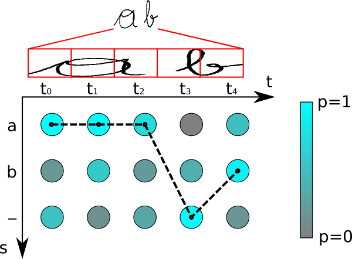
```


### Beam Search, A CTC Decoding Algorithms

- from [Word Beam Search: A CTC Decoding Algorithm](https://towardsdatascience.com/word-beam-search-a-ctc-decoding-algorithm-b051d28f3d2e)

- Greedy Decoding
- Beam Search
- Beam Search with character-LM (Language Model)
- Token Passing, which uses a dictionary and word-LM

- Word Beam Search
    - Pros of Beam search and Token Passing
    - [Word Beam Search: A connectionist temporal classification decoding algorithm, Scheidl, Fiel, Sablatnig, 2018](https://repositum.tuwien.ac.at/obvutwoa/content/titleinfo/2774578)  16th International Conference on Frontiers in Handwriting Recognition (CFHR 2018)

## Sound Signal Sampling & Quantization

```{r audioSignal, echo=FALSE, fig.align='center', fig.cap='A wave form of HELLO'}
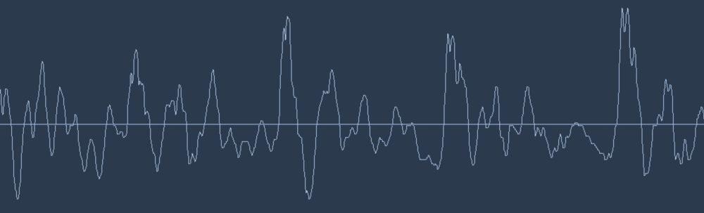
```

```{r audioSampling0, echo=FALSE, fig.align='center', fig.cap='Sampling an audio signal.'}
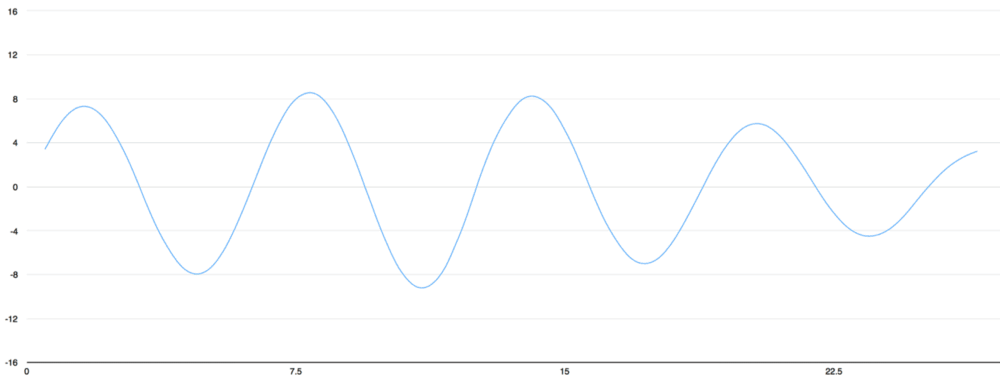
```
```{r audioSampling1, echo=FALSE, fig.align='center', fig.cap='Sampling an audio signal.'}
knitr::include_graphics('figures/audio-sampling-steps-1.png')
```
```{r audioSampling2, echo=FALSE, fig.align='center', fig.cap='Sampling an audio signal.'}
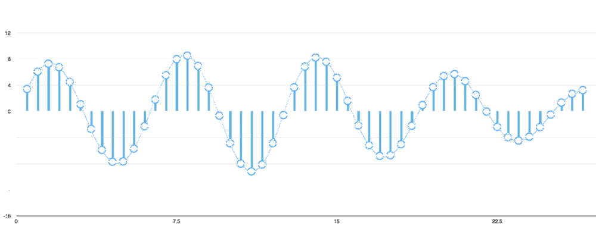
```
```{r audioSampling3, echo=FALSE, fig.align='center', fig.cap='Sampling an audio signal.'}
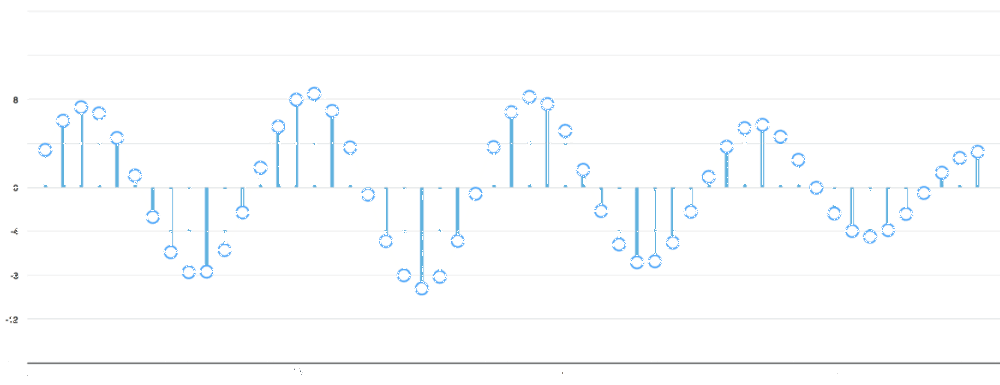
```

- uncompressed `.wav` audio file contains such sampled data.
- Normally, 44.1KHz sampling (= 44,100 samples/seconds), 16KHz sampling is sufficient for human voice signal

```{r audioSamples, echo=FALSE, fig.align='center', fig.cap='Amplitude values of an audio signal.The AD conversion resolutioin seems to be about 16bits per audio sample.'}
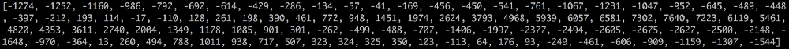
```

- Fig. \@ref(fig:audioSamples) shows a sequence of sampled values at the rate of 16000Hz.


## Data Preprocessing: FFT, Spectrogram

1. Take samples of 20 mili-second (@ 16KHz = 320 sample numbers)

```{r audio320msd, echo=FALSE, fig.align='center', fig.cap='A set of samples for 20 mili-seconds.'}
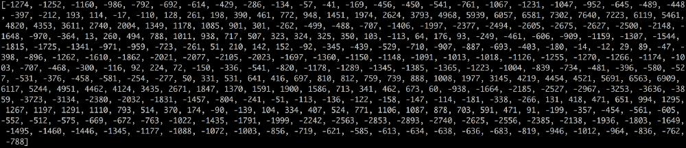
```
```{r audio320msg, echo=FALSE, fig.align='center', fig.cap='A set of samples for 20 mili-seconds.'}
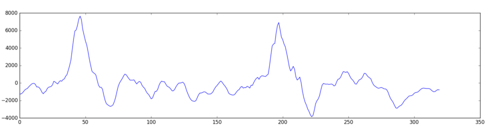
```

2. Apply FFT and compute Power Spectrum.

```{r audioPS, echo=FALSE, fig.align='center', fig.cap='Power spectrum of the 320-length (20 ms) signal represented by red-blue colors.'}
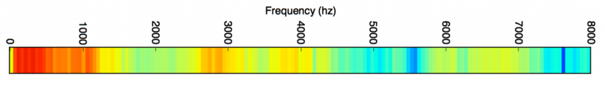
```

```{r audioSG, echo=FALSE, fig.align='center', fig.cap='Spectrogram of the whole signal represented by red-blue colors. Each column corresponds to a power spectrum, a feature vector of the 20ms signal.'}
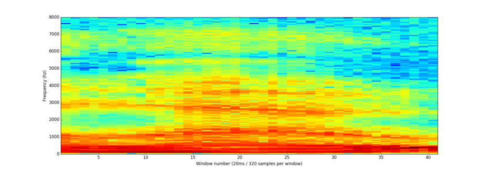
```

## Feature recognition from short signals

1. Each feature is fed into RNN to produce a classification result.

```{r audioRNN, echo=FALSE, fig.align='center', fig.cap='Deep RNN for audio classification.'}
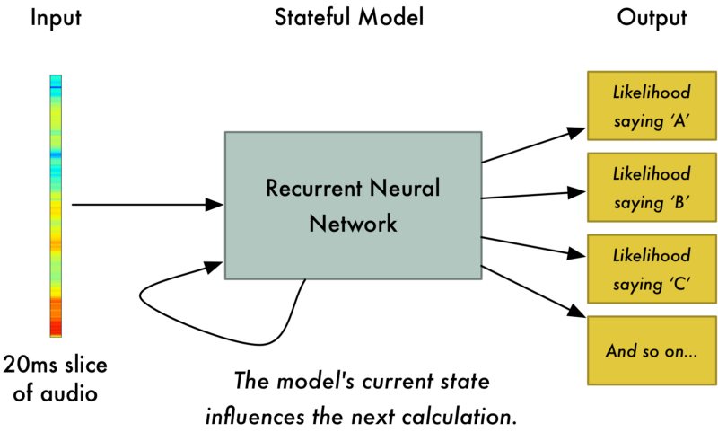
```

2. This is the resultant output for 420ms long sequence. 

```{r audioRNNtable, echo=FALSE, fig.align='center', fig.cap='A Table of Deep RNN for audio classification.'}
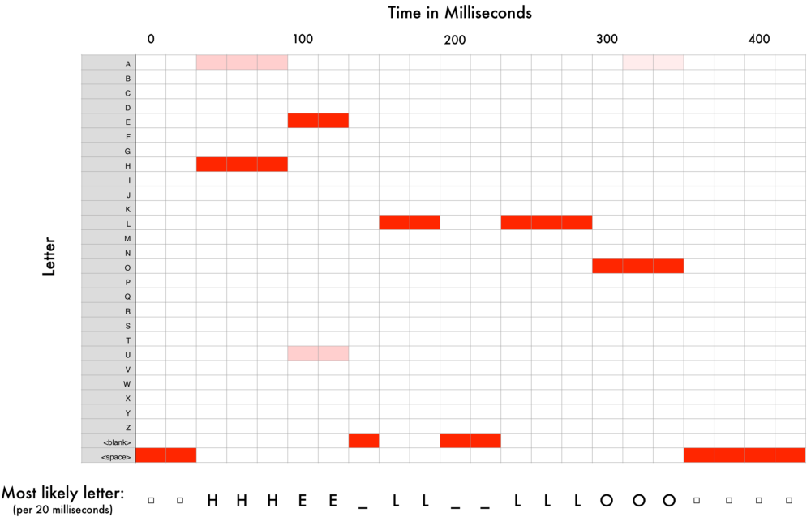
```

- Possibles outputs are: HHHEE_LL_LLLOOO, HHHUU_LL_LLLOOO, AAAUU_LL_LLLOOO

3. Remove all the spaces and gather repeted chars to one: HE_L_LO, HU_L_LO, AU_L_LO

4. Among the three transcriptions, Hello will be chosen as the final output.

