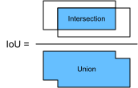
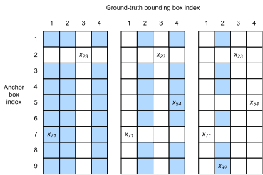

---
output:
  pdf_document: default
  html_document: default
---

# Object Detection

- Check out [Dive into Deep Learning](http://d2l.ai/chapter_computer-vision/index.html)

- Q. Try to figure out the size of receptive field for VGG-16 network.


## Bounding Boxes, Anchor Boxes

- Anchor boxes mean a set of boxes defined for an input image location.
- An anchor box is a hypothetic box that an object may exist inside. The box's anchor location is the image location.
- Since the size of the objects may vary from object to object or from an image scale to scale, we consider multiple anchor boxes at an image location (e.g., 5 for the figure below).

```{python bbox, code=readLines('python/bbox.py')}
```
* So the image location (250,250) has 5 anchor boxes. Other image locations will also have 5 boxes each.

## IoU: Intersection over Union
```{r iou, fig.align='center', fig.cap='IoU = Intersection over Union'}

```


## Labeling Training Set Anchor Boxes

In order to train the object detection model, we need to mark two types of GT data for each anchor box:
1. (1 category) the category of the target contained in the anchor box
2. (4 offsets) the offset of the gt bbox relative to the anchor box.

In prediction stage, the network produces
1. (category, 4 offsets) for each anchor box,
2. then the anchor box position is adjusted according to the predicted offsets,
3. filter out the prediction bounding boxes (choose only appropriate ones).

- In the training set for object detection, each image is labelled with the location of the gt bounding box and the category of the target contained.
- So how do we assign gt bboxes to anchor boxes similar to them?

```{r anchorLabel, fig.align='center', fig.cap='Assigning GT bounding boxes to anchor boxes. From left to right, it shows 3 steps.'}

```

1. Build a matrix $X$ of size $n_a \times n_b$ where $n_a$ is the num. of anchor boxes and $n_b$ is the num. of gt bboxes. $x_{ij}$ is the IoU.
2. Find the largest element in $X$. It is the assignment pair obtained.
    - The IoU value must be greater than a predetermined threshold. Otherwise, no further assigning is necessary.
    - Then this gt box cannot be assigned to any other anchors. Disable all the rows and columns corresponding to this.
    - The left matrix in the figure shows the current status.
3. repeat 2 until all the categories are assigned.
4. For the remainings: for each anchor, assign a gt box of the largest IoU if it is greater than the threshold. Otherwise, assign 'background' category.

* For all the (A, G) pairs obtained from this assignment operation, we can record the category of G and compute the offset of A from G.
* All other anchors are marked as background (no-object). Offsets are not necessary.
* The offsets are recorded using the following equation:
\[
    \bigg(
        s_x \frac{x_g - x_a}{w_a},\ 
        s_y \frac{y_g - y_a}{h_a},\ 
        s_w \log (w_g / w_a) , \ 
        s_h \log (h_g / h_a)
    \bigg)
\]
where $s_x = s_y = 10$ and $s_w = s_h = 5$, which are user-defined scale constants.

* Notice that these 4 offset values are the quantities that our NN should predict for the outputs of the corresponding anchors.


## NMS: Output Bounding Boxes for Prediction
