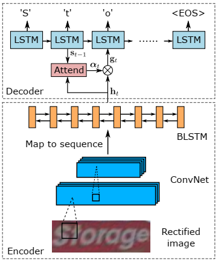

# ASTER: Attentional Scene Text Recognizer with Flexible Rectification

- [tpami 2018]
- [bgshih/aster@github.com](https://github.com/bgshih/aster)
- [vlrlab.net](http://www.vlrlab.net/representatives/6)

- Try [this code by Clova AI](https://github.com/clovaai/deep-text-recognition-benchmark) instead, which performed a text recognition benchmark

- The part of Image Rectification will not be discussed here.


- For text recognition, the text image blob is assumed to be detected by an algorithm like CRNN.


## Overall Architecture

```{r, echo=FALSE, fig.align='center', fig.cap='Attention mechanism in ASTER text recognition network'}

```

Algorithm is as follows:

1. Through a ConvNet, the input is processed in such a way that the output feature map has the height 1.
    - The feature map shape: $d\times 1 \times w_\mathrm{conv}$ (in pytorch convention)
1. The feature map is reshaped and converted into a sequence whose length is $w_\mathrm{conv}$.
1. Multi-layer BiLSTM network is applied to the feature amp to  produce `H=[h1, h2, ..., hn]` where $n = w_\mathrm{conv}$.
1. Attentional sequence-to-sequence model is a unidirectional recurrent network.
    - $y_{t-1}$ : prediction obtained in the previous step.
        - $y_0$: initial input `<SOS>`, indicating the start of the sequence.
    - $s_{t-1}$ : the internal state of LSTM or GRU. ($s_0=0$)
    1. compute $e_{t,i} \in \mathbb{R}$ for each $h_i \in H$:
    \[
        e_{t,i} = w^{\top} \mathrm{tanh}(W s_{t-1} + V h_{i} + b)
    \]
    2. compute $\alpha_{t,i}$ with $\mathrm{softmax()}$:
    \[
        \alpha_{t,i} = \mathrm{softmax}(e_{t,i})
    \]
    3. compute the *glimpse* vector $g_t$:
    \[
        g_t = \sum_{i=1}^n \alpha_{t,i} h_i
    \]
    4. Put $g_t$ and $y_{t-1}$ to the RNN to get its output:
    \[
        (x_t, s_t) = GRU\big( [g_t, f(y_{t-1})], s_{t-1} \big)
    \]
    where $f(y_{t-1})$ is the one-hot embedding of $y_{t-1}$
    5. compute score vector for $y_t$ from $x_t$
    \[
        p(y_t) = \mathrm{softmax}\big( W_o x_t + b_o \big)
    \]
    6. compute the output $y_t$:
        - by greedy scheme: $y_t = \mathrm{arg max}\ p(y_t)$
        - by beam search, by maintining the $k$ candidates with the top accumulative scores at every step.
        
* The decoder module learns to capture the dependencies between its output characters, which acts as an implicit *language model* that assists the recognition with the language priors it learns.


## Related

- [Show, attend, and tell, pytorch tutorial by sgrvinod@github.com](https://github.com/sgrvinod/a-PyTorch-Tutorial-to-Image-Captioning)
