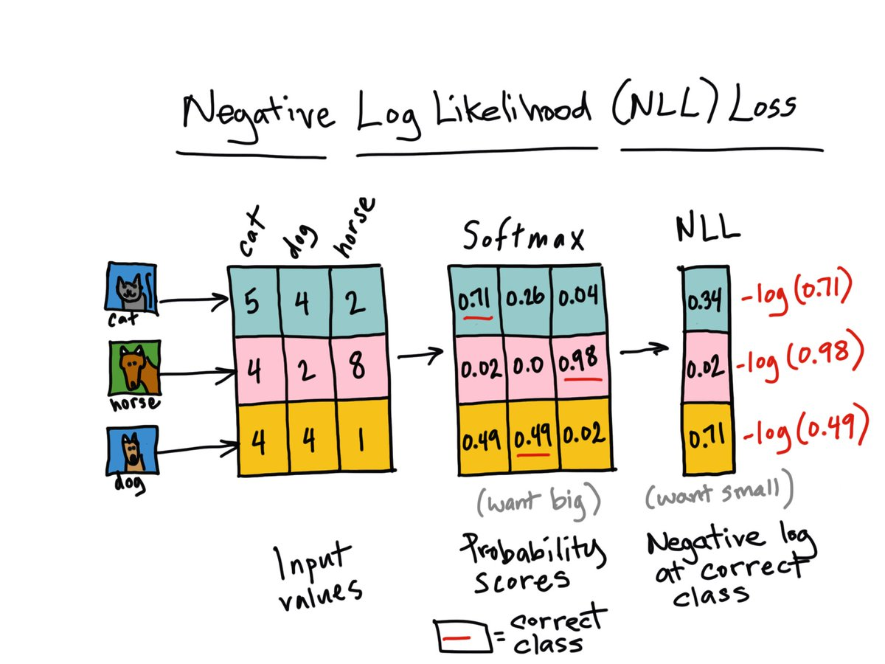

# Classifying Names with a Character-Level RNN

- The Story is from [Pytorch Tutorial Char-RNN-Classification](https://pytorch.org/tutorials/intermediate/char_rnn_classification_tutorial.html)
    - `colab` notebook is at the site, which you can run on-line with the help of google's Colab service.

## Simple RNN

```{r simpleRNN, echo=FALSE, fig.align='center', fig.cap='Simple RNN'}
knitr::include_graphics('./figures/rnn-simple.png')
```

- The input is a sequence of variable length. So we will use a `for`-loop to feed one element by one of the sequence to the network model.
- RNN input is composed of two parts: (`input`, `hidden`) where `hidden` is the output of the RNN at the previous computation of the RNN.

## `torch.nn.NLLLoss`

- The Negative  log likelihood loss.
- Useful to train a classification problem with C classes.
- The input given through a forward call is expected to contain log-probabilities of each class. `input` has to be a tensor of size (mini_batch, C).

- Definition of negative log likelihood:
$$
    \mbox{nll}_i = -\log \mbox{likelihood}_i = -\log P(\hat y_i |x_i; w)
$$
where $P$ is given by `softmax`, or $\log(P)$ is given by `LogSoftmax()`.

- Negative log likelihood loss for the batch:
$$
    L = -\frac{1}{N} \sum_{i=1}^N \log P(\hat y_i |x_i; w)
$$

- Various [Loss Functions are well summarized in a post](https://isaacchanghau.github.io/post/loss_functions/).

```{r nllLoss, echo=FALSE, fig.align='center', fig.cap='Negative Log Likelihood (NLL) Loss'}

```


## Source Code

```{python charRNNClassfy, code=readLines('python/char_rnn_classification_tutorial.py')}
```

