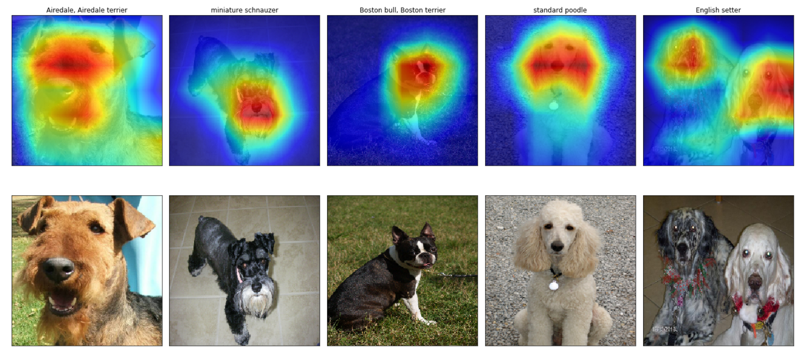

# Global Average Pooling

- [Network in Network, 2014, Min Lin, Qiang Chen, Shuicheng Yan](https://arxiv.org/pdf/1312.4400.pdf). Section 3.2's title is Global Average Pooling.

- [A good explanation blog on GAP is here](https://alexisbcook.github.io/2017/global-average-pooling-layers-for-object-localization/). Figures are from this blog.

```{r, echo=FALSE, fig.align='center', fig.cap='VGG-16 model architecture.'}
knitr::include_graphics('figures/vgg16.png')
```

- The size of the feature maps in the middle is reduced to half because of the max pooling (red color).

```{r, echo=FALSE, fig.align='center', fig.cap='VGG-16 model architecture.'}
knitr::include_graphics('figures/vgg-16-arch.png')
```

- The output of `conv1` of VGG16 is of the same size as the input.
- `conv2` gives half size.
- `conv3' gives 1/4 size of the input
- `conv5` gives 1/16 size of the input. So a pixel in this feature map corresponds to 16x16 in the input image.

In pytorch, the vgg16 convolution blocks are not shown as we can check by printing out the model structure below.

```{python}
import torch
import torchvision

vgg = torchvision.models.vgg16()
print(vgg)
```

- See the (avgpool) in VGG-features part. It is a `pytorch.nn` function
```
  AdaptiveAvgPool2d(output_size=(7,7))
```
This function will accept a CHW tensor and produce C77 tensor by applying an average operation on each of the adaptively generated $7\times7$ grids on the input tensor. It is **Global Average Pooling**

- The size (H,W) of the input tensor should be larger than (7,7), of course.
- Through this operation, we have a flexibility in choosing the size of the input image.
- We can replace the (classifier) layer with a network of less parameters.


```{r, echo=FALSE, fig.align='center', fig.cap='GAP operation. 3x6x6 -> 3x1x1'}
knitr::include_graphics('figures/global_average_pooling.png')
```


Resnet uses GAP at the final stage.
```{python}
resnet = torchvision.models.resnet18()
print(resnet)
```

At the last stage of the Resnet, we find GAP that reduces the input tensor's $H\times W$ to $1\times 1$:
```{python}
print(resnet.avgpool)
```

It is then connected to a fully connected layer composed of a weight matrix $W$ of size $512\times1000$ to produce 1000 scores for the classes.

```{r, echo=FALSE, fig.align='center', fig.cap='Class activation mapping.'}
knitr::include_graphics('figures/class_activation_mapping.png')
```

Let $f_k$ be the $k$-th feature map just before GAP. Its output $a_k$ through GAP is 
$$
  a_k = \frac{1}{HW}\sum_{i,j\in HW} f_k (i,j) = AVG(f_k)
$$
The score for a class $n \in \{1,...,1000\}$ is
$$
  score(n) = \sum_{k} a_k w_{kn} = \sum_k AVG(f_k) w_{kn} = AVG(\sum_k f_k w_{kn})
$$

Now the insde of $AVG()$ is called the class activation map for $n$-th object. We don't have to examine it for all the classes, but normally want to see for the object of highest score.

The figure assumes that the output class of the highest score was Australian terrier. 

We can compute the class activation map through a comutation (the index $n$ for this class is omitted):
$$
     camap(\mbox{Australian terrier}) = w_1 \cdot f_1 + w_2 \cdot f_2 + \ldots + w_{512}\cdot f_{512}
$$

Since the feature map is not the size of input image, it needs to be upsampled for visualization:

```{r, echo=FALSE, fig.align='center', fig.cap='Class activation map provides localization information'}

```


Q. Visualize a class activation maps for 
    - bees/ants classification problem, or 
    - dogs breed problem.


## Why GAP

GAP is known to reduce overfitting.

- [A comment in the blog site says](https://alexisbcook.github.io/2017/global-average-pooling-layers-for-object-localization/)

> Imagine I show my network images of dogs all in the right hand side. So now my final activation map before flatten layers will only have high activations on right side and the connections to flatten will be trained to only have high weights in that region. So if my dog is now on left, that region does not have high weights to fc layer and is not detected.
>
> By doing a global average we make the convolution invariant to where the object of interest is and this acts as a data augmentaiton of moving the object around to different regions. This prevents overfitting of the fc layers.
