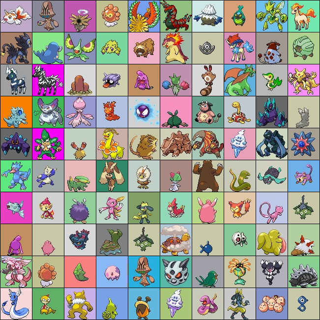
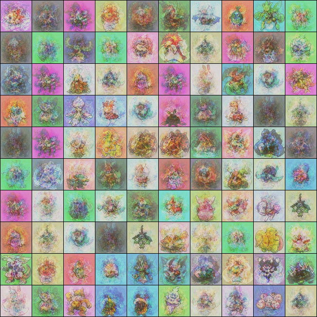
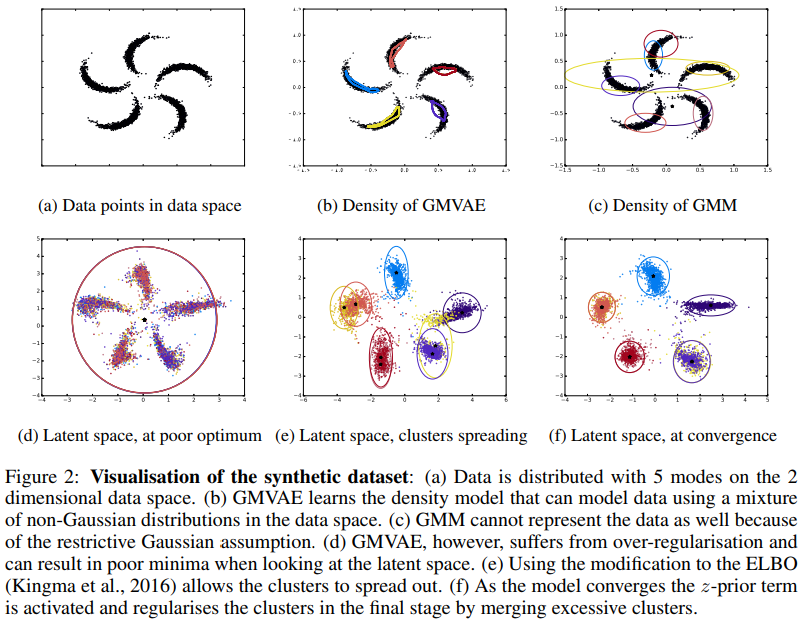
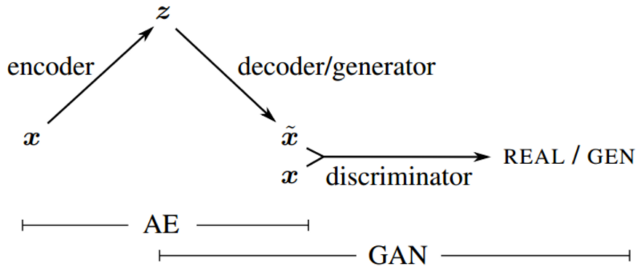

# Auto Encoder Models

```{r, echo=FALSE, fig.align='center', fig.cap='Encoder-Decoder Model'}
knitr::include_graphics('figures/auto-encoder-concept.png')
```

Autoencoder model has evolved since 2006 and can be listed as follows. See [From Autoencoder to Beta-VAE](https://lilianweng.github.io/lil-log/2018/08/12/from-autoencoder-to-beta-vae.html)

1. Auto Encoder Model
    - *Autoencoder* is a neural network designed to learn an identity function in an unsupervised way to reconstruct the original input while compressing the data in the process so as to discover a more efficient and compressed representation. The idea was originated in the 1980s, and later promoted by the seminal paper by Hinton & Salakhutdinov, 2006.

1. Convolutional Autoencoder
1. Denoising Autoencoder
1. Sparse Autoencoder
1. Contractive Autoencoder
1. Variational Autoencoder (VAE)
    - Loss Function (KD Divergence)
    - Reparametrization Trick
1. Beta-VAE
1. VQ-VAE
1. DRAW


## Autoencoder with Linear Network

- Following is a simple autoencoder.
- It tries to run a set of representations of the 10 number images. Each image of dimension 28x28 is compressed to `rep_dim=4` float32 numbers. After enough iteration, you will find the decoder produce very similar view of the input image.

```{python simpleAE, eval=FALSE, code=readLines('python/autoencoder-simple.py')}
```

```{r simpleAESample, echo=FALSE, fig.align='center', fig.cap='Sample output after 1 epoch of training (dim=4).'}
knitr::include_graphics('data/samples/image_0.png')
```

```{r simpleAESampleAnother, echo=FALSE, fig.align='center', fig.cap='Sample output after 40 epochs of training'}
knitr::include_graphics('data/samples/image_40.png')
```


### Can we compress MNIST images to 2-dimensional space?
Apply the following codes, and report your own result.
```{python simpleAETry, eval=FALSE}
#
rep_dim = 2
# run auto-encoder learning

#
features = []
labels = []
for batch in dataloader:
    ibatch, ilabel = batch
    ibatch = ibatch.view(ibatch.size(0), -1).to(device)
    feat = model.encode (ibatch)
    features.append (feat)
    labels.append (ilabel)
#
# now display the whole set of features in 2 dimensional space

```

### Pokemon Example
Applied Pokemon images to an AE model, provided `github` in [Pokemon AE](https://github.com/niazangels/vae-pokedex/),
```{r, echo=FALSE, fig.align='center', fig.cap='Pokemon Images '}

```
By choosing 4 dimensional representation (that is, the final output of encoder has only 4 values), the AE output looked like this.
```{r, echo=FALSE, fig.align='center', fig.cap='Pokemon Images (https://github.com/niazangels/vae-pokedex/)'}

```


## Convolutional Autoencoder

```{python convAE, eval=FALSE, code=readLines('python/autoencoder-conv.py')}
```

```{r convAESample, echo=FALSE, fig.align='center', fig.cap='Sample output after 90 epochs of training (rep dim=4) by convolutional AE.'}
knitr::include_graphics('data/samples_dc/samples_dc_90.png')
```

- Autoencoder with convolutional layers.
    - It was not easy to get a good decoder outputs compared to the autoencoder with linear layers.
    - Try to use `Maxpool2d(return_indices=True)` in encoder and `MaxUnpool2d()` in decoder.
    - Q. Find why.


## Autoencoders
- this is taken from [From Autoencoder to beta VAE](https://lilianweng.github.io/lil-log/2018/08/12/from-autoencoder-to-beta-vae.html)


### Autoencoder

Autoencoder is a neural network designed to learn an identity function in an unsupervised way to reconstruct the original input while compressing the data in the process so as to discover a more efficient and compressed representation. The idea was originated in the 1980s, and later promoted by the seminal paper by Hinton & Salakhutdinov, 2006.

```{r AEarchi, echo=FALSE, fig.align='center', fig.cap='Autoencoder Architecture'}
knitr::include_graphics('figures/auto-encoder-concept.png')
```


### Denoising Autoencoder
Since the autoencoder learns the identity function, we are facing the risk of “overfitting” when there are more network parameters than the number of data points.

To avoid overfitting and improve the robustness, Denoising Autoencoder (Vincent et al. 2008) proposed a modification to the basic autoencoder. The input is partially corrupted by adding noises to or masking some values of the input vector in a stochastic manner, x~∼MD(x~|x). Then the model is trained to recover the original input (Note: Not the corrupt one!).

```{r denoisingAE, echo=FALSE, fig.align='center', fig.cap='Denoising Autoencoder Architecture'}
knitr::include_graphics('figures/denoising-autoencoder-architecture.png')
```
This design is motivated by the fact that humans can easily recognize an object or a scene even the view is partially occluded or corrupted. To “repair” the partially destroyed input, the denoising autoencoder has to discover and capture relationship between dimensions of input in order to infer missing pieces.

For high dimensional input with high redundancy, like images, the model is likely to depend on evidence gathered from a combination of many input dimensions to recover the denoised version (sounds like the attention mechanism, right?) rather than to overfit one dimension. This builds up a good foundation for learning robust latent representation.

The noise is controlled by a stochastic mapping $M_D(\tilde x|x)$, and it is not specific to a particular type of corruption process (i.e. masking noise, Gaussian noise, salt-and-pepper noise, etc.). Naturally the corruption process can be equipped with prior knowledge

In the experiment of the original DAE paper, the noise is applied in this way: a fixed proportion of input dimensions are selected at random and their values are forced to 0. Sounds a lot like dropout, right? Well, the denoising autoencoder was proposed in 2008, 4 years before the dropout paper (Hinton, et al. 2012) ;)


### Sparse autoencoder & Contractive autoencoder

Similar to sparse autoencoder, Contractive Autoencoder (Rifai, et al, 2011) encourages the learned representation to stay in a contractive space for better robustness.


### VAE: Variational Autoencoder

The idea of Variational Autoencoder (Kingma & Welling, 2014), short for VAE, is actually less similar to all the autoencoder models above, but deeply rooted in the methods of variational bayesian and graphical model.

```{r VAE, echo=FALSE, fig.align='center', fig.cap='VAE: Variational Autoencoder Architecture'}
knitr::include_graphics('figures/vae.png')
```

```{r vaeGaussian, echo=FALSE, fig.align='center', fig.cap='Illustration of variational autoencoder model with the multivariate Gaussian assumption'}
knitr::include_graphics('figures/vae-gaussian.png')
```

#### Pytorch code example

```{python vaePytorch, eval=FALSE, code=readLines('python/autoencoder_vae.py')}
```

- Sample output using the trained decoder with random inputs $z\sim N(0,1)$

```{r, fig.align='center', fig.cap='Sample output from VAE decoder'}
knitr::include_graphics('data/samples_vae/sampled-15.png')
```

- Reconstruction using encoder-decoder
```{r, fig.align='center', fig.cap='Comparison of Input with reconstructed output with VAE'}
knitr::include_graphics('data/samples_vae/reconst-15.png')
```


#### About Sampling from $N(0,I)$

*Q.* Why sampling starts by generating a random vector from $N(0,I)$ for the latent variable $z$ which is then fed into decoder network.

*A.*
The prior probability $p(z)$ is defined to be a standard normal distribution, so sampling from that would be sufficient.

The distribution of the latent space over images in your dataset as estimated by the network, $q(z)=q(z|x)f(x)$, is a different matter, but in a well-trained VAE, it should approach $p(z)$ -- because it is encouraged to by the KL-divergence loss. (where $f(x)$ is the density of your training data).


#### VAE Explanations 
- [Intuitively understanding VAE](https://towardsdatascience.com/intuitively-understanding-variational-autoencoders-1bfe67eb5daf)
    - [Hierarchical VAE for Music](https://nips2017creativity.github.io/doc/Hierarchical_Variational_Autoencoders_for_Music.pdf)
- [VAE in Keras, detailed!](https://blog.keras.io/building-autoencoders-in-keras.html)

#### Applications
- Reconstruction of (noisy) input
- Clustering
- Generation

```{r, fig.align='center', fig.cap='MNIST digits from 2D latent space (https://blog.keras.io/building-autoencoders-in-keras.html)'}
knitr::include_graphics('figures/vae_digits_manifold.png')
```

#### Gaussian Mixture VAE
- [GAUSSIAN MIXTURE VAE: LESSONS IN VARIATIONAL INFERENCE, GENERATIVE MODELS, AND DEEP NETS](http://ruishu.io/2016/12/25/gmvae/)

- [Deep Unsupervised Clustering with Gaussian Mixture Variational Autoencoders. Nat Dilokthanakul, Pedro A.M. Mediano, Marta Garnelo, Matthew C.H. Lee, Hugh Salimbeni, Kai Arulkumaran, Murray Shanahan](https://arxiv.org/pdf/1611.02648.pdf)

```{r, fig.align='center', fig.cap='Deep Unsupervised Clustering with Gaussian Mixture Variational Autoencoders. Nat Dilokthanakul, Pedro A.M. Mediano, Marta Garnelo, Matthew C.H. Lee, Hugh Salimbeni, Kai Arulkumaran, Murray Shanahan.'}

```


#### VAE-GAN

```{r, fig.align='center', fig.cap='VAE-GAN architecutre, the discriminator from GAN takes input from VAE\'s decoder.'}

```

- A major drawback of VAEs is the blurry outputs that they generate. As suggested by Dosovitskiy & Brox, VAE models tend to produce unrealistic, blurry samples. This has to do with how data distributions are recovered and loss functions are calculated in VAEs in which we will discuss further below. A 2017 paper by [Zhao et. al.](https://arxiv.org/pdf/1702.08658.pdf) has suggested modifications to VAEs to not use variational Bayes method to improve output quality.

-  The final output of GAN, $D(x)$, can then be used to calculate its own loss function, resulting in improved performance. See [“Autoencoding beyond pixels using a learned similarity metric” by A. Larsen et. al.](https://arxiv.org/abs/1512.09300)


### Sequence-to-Sequence Autoencoder
- see [the tutorial about autoencoders in Keras](https://blog.keras.io/building-autoencoders-in-keras.html)
