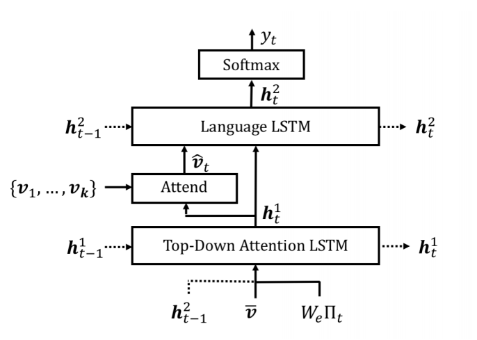

# Bottom-up & Top-down Attention for Image Captioning

* The winning entry of the 2017 [VQA Challenge](https://visualqa.org/challenge.html)

- Visual feature set is provided from Faster RCNN.
    - Then `decoder` module produces a sequence of words (captioning)
    - This is called bottom-up attention
    - Expectedly, unimportant parts of the image would not be fed to the `decoder`.
    
    - RCNN module should be learned separately.
    - NMS ? 
    
- [pytorch impl. by hengyuan-hu](https://github.com/hengyuan-hu/bottom-up-attention-vqa)

```{r, fig.align='center', fig.cap='BUTD Attention model for image captioning'}

```


### Ref

1. Show and Tell
2. Show, Attend, and Tell
3. Show, Ask, Attend, and Tell (?)
4. Bottom-up & Top-down attention