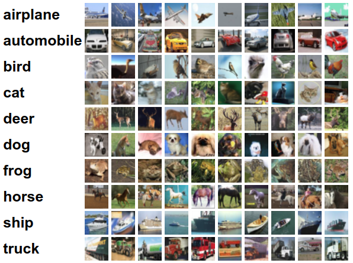
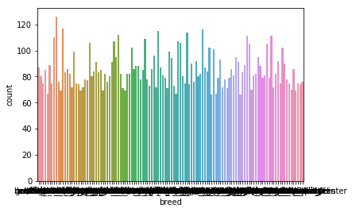
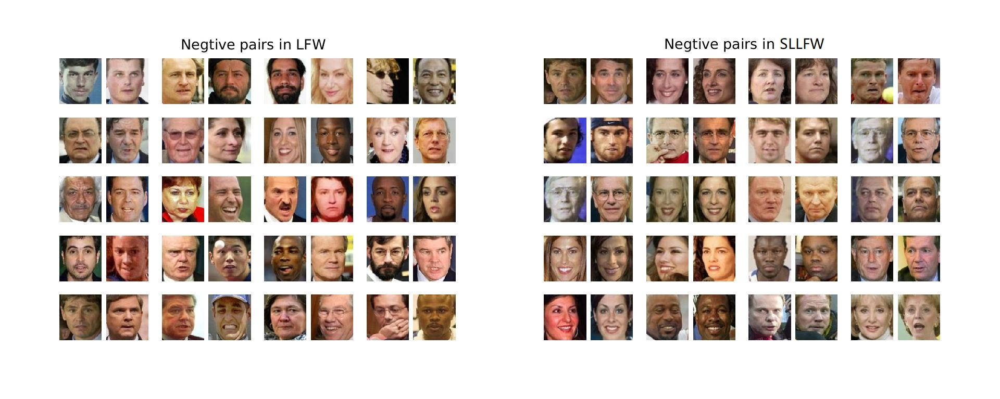
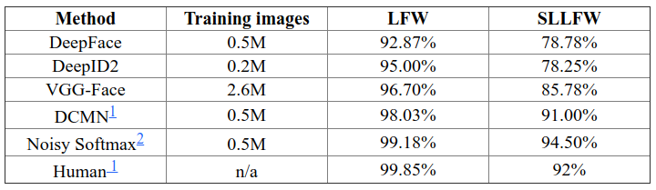

# Datasets

## From Google Search

- see [How to create a deep learning dataset using Google images](https://www.pyimagesearch.com/2017/12/04/how-to-create-a-deep-learning-dataset-using-google-images/)
    - search images at images.google.com
    - Javascript provided to download all the links to the images
    - Video explanation at [fast.ai course v3](https://course.fast.ai/videos/?lesson=2) 17:04.
    
## MNIST


## Fashion-MNIST

* [Fashion-MNIST](https://github.com/zalandoresearch/fashion-mnist)
* Fashion-MNIST: a Novel Image Dataset for Benchmarking Machine Learning Algorithms. Han Xiao, Kashif Rasul, Roland Vollgraf. arXiv:1708.07747

Fashion-MNIST is a dataset of Zalando's article images
    — a training set of 60,000 examples 
    - a test set of 10,000 examples. 
    - each example is a 28x28 grayscale image
    - associated with a label from 10 classes. 
    
We intend Fashion-MNIST to serve as a direct drop-in replacement for the original MNIST dataset for benchmarking machine learning algorithms. It shares the same image size and structure of training and testing splits.

```{r, fig.align='center', fig.cap='Sample Images'}
knitr::include_graphics('figures/fashion-mnist-sprite.png')
```

## CIFAR10 / CIFAR100 

* [CIFAR-10 & CIFAR-100](http://www.cs.utoronto.ca/~kriz/cifar.html)

1. 32x32 natural image dataset
1. 6000 images per class, 10 classes
1. 50000 training images
1. 10000 test images

```{r, fig.align='center', fig.cap='Sample Images'}

```


## Image Net

## Dog Breeds: Standford Dogs Dataset

```{r, fig.align='center', fig.cap='Sample Images'}
knitr::include_graphics('figures/border_collies.png')
```


The Stanford Dogs dataset contains images of 120 breeds of dogs from around the world. This dataset has been built using images and annotation from **ImageNet** for the task of fine-grained image categorization. Contents of this dataset:

- [Stanford dogs dataset](http://vision.stanford.edu/aditya86/ImageNetDogs/)
- Num of categories: 120
- Num of images: 20,580
- Annotations: 
    - Class labels
    - Bounding boxes

Below is [from a kaggle.com notebook](https://www.kaggle.com/wakamezake/dog-breed-chainer-tutorial)
```{r, fig.align='center', fig.cap='Num of images against breed'}

```

* [Dog Breed Identification in kaggle.com](https://www.kaggle.com/c/dog-breed-identification)


## Cats & Dogs, Fine grained

* [The Oxford-IIIT Pet Dataset](http://www.robots.ox.ac.uk/~vgg/data/pets/)

```{r, fig.align='center', fig.cap='Num of images against breed'}
knitr::include_graphics('figures/pet_annotations.jpg')
```

We have created a 37 category pet dataset with roughly 200 images for each class. The images have a large variations in scale, pose and lighting. All images have an associated ground truth annotation of breed, head ROI, and pixel level trimap segmentation. 

```{r, fig.align='center', fig.cap='Dataset Statistics of the Pet Dataset'}
knitr::include_graphics('figures/pet_breed_count.jpg')
```


## Deep Fashion: Large-scale Fashion Database

* [Deep Fashion Dataset](http://mmlab.ie.cuhk.edu.hk/projects/DeepFashion.html)

We contribute DeepFashion database, a large-scale clothes database, which has several appealing properties:

1. DeepFashion contains over 800,000 diverse fashion images ranging from well-posed shop images to unconstrained consumer photos.
1. DeepFashion is annotated with rich information of clothing items. Each image in this dataset is labeled with 50 categories, 1,000 descriptive attributes, bounding box and clothing landmarks.
1. DeepFashion contains over 300,000 cross-pose/cross-domain image pairs.

- Four benchmarks are developed using the DeepFashion database, including Attribute Prediction, Consumer-to-shop Clothes Retrieval, In-shop Clothes Retrieval, and Landmark Detection. The data and annotations of these benchmarks can be also employed as the training and test sets for the following computer vision tasks, such as Clothes Detection, Clothes Recognition, and Image Retrieval. 


```{r, fig.align='center', fig.cap='Deep Fashion: Attribute Prediction'}
knitr::include_graphics('figures/deepfashion-attributes.jpg')
```


## LFW: Labeled Faces in the Wild

* [SLLFW: Similar-looking LFW Database](http://www.whdeng.cn/SLLFW/index.html)

As performance on some aspects of LFW benchmark approaches 100% accuracy, there is an intense debate on whether unconstrained face verification problem has already been solved. Common face verification addresses mainly large intra-class variations, such as pose, illumination, and expression. After inspecting the LFW databases, one can identify a main limiting factor for its unconstrained face verification task: almost all the negative face pairs are quite easy to distinguish. The negative pairs are randomly selected from different individual, and it is common that two random individuals have large differences in appearance. Many face pairs even have different genders. Thus, verification is, by its nature a problem in which many examples are very easy with large inter-class variance, because the collection of LFW database is based on the assumption of random imposter attack. For practical usage, however, it is likely that a desperate impostor may attempt to spoof a genuine user by seeking a similar-looking people. To simulate this deliberate imposture attack, we construct SLLFW database, which deliberately selects 3000 similar-looking face pairs within original image folders by human crowdsourcing to replace the random negative pairs in LFW.

```{r, fig.align='center', fig.cap='Negative pairs in SLLFW'}

```

```{r, fig.align='center', fig.cap='Varification accuracy on LFW and SLLFW'}

```
