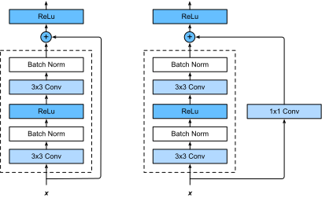

# Transfer Learning

## Validation Loss is more important

The purpose of machine learning is to build a machine that predicts well for a general untrained input, not to predict well for the trained inputs.

## Transfer Learning

This part is from [Tranfer Learning Tutorial](https://pytorch.org/tutorials/beginner/transfer_learning_tutorial.html) in `pytorch.org` tutorial section.

In this tutorial, you will learn how to train your network using
transfer learning. You can read more about the transfer learning at [cs231n
notes](http://cs231n.github.io/transfer-learning)

Quoting these notes,

    In practice, very few people train an entire Convolutional Network
    from scratch (with random initialization), because it is relatively
    rare to have a dataset of sufficient size. Instead, it is common to
    pretrain a ConvNet on a very large dataset (e.g. ImageNet, which
    contains 1.2 million images with 1000 categories), and then use the
    ConvNet either as an initialization or a fixed feature extractor for
    the task of interest.

These two major transfer learning scenarios look as follows:

-  **Finetuning the convnet**: Instead of random initializaion, we
   initialize the network with a pretrained network, like the one that is
   trained on imagenet 1000 dataset. Rest of the training looks as
   usual.
-  **ConvNet as fixed feature extractor**: Here, we will freeze the weights
   for all of the network except that of the final fully connected
   layer. This last fully connected layer is replaced with a new one
   with random weights and only this layer is trained.


### The whole source code:

```{python, eval=FALSE, code=readLines('srcs/transfer_learning_tutorial.py')}
```

### CNN Model for Classification

Notice that `model_conv` adopts `resnet18` architecture, whose building bloks are provided in the python `torchvision.models` module.

```{python}
import torchvision
model_conv = torchvision.models.resnet18(pretrained=True)
print (model_conv)
```

Compare the output with the block diagram of resnet-18 below.

```{r, echo=FALSE, fig.align='center', out.width='95%', fig.cap='ResNet-18 Architecture.'}
knitr::include_graphics('figures/resent-18-arch.png')
```

```{python, eval=FALSE}
for param in model_conv.parameters():
    param.requires_grad = False

# Parameters of newly constructed modules have requires_grad=True by default
num_ftrs = model_conv.fc.in_features
model_conv.fc = nn.Linear(num_ftrs, 2)

model_conv = model_conv.to(device)

criterion = nn.CrossEntropyLoss()

# Observe that only parameters of final layer are being optimized as
# opoosed to before.
optimizer_conv = optim.SGD(model_conv.fc.parameters(), lr=0.001, momentum=0.9)

# Decay LR by a factor of 0.1 every 7 epochs
exp_lr_scheduler = lr_scheduler.StepLR(optimizer_conv, step_size=7, gamma=0.1)
```


### Resnet-18

```{r, echo=FALSE, fig.align='center', fig.cap='ResNet Basic Block Architecture. (The figure is from www.d2l.ai)'}

```

We can modify the source code of `ResNet` block. Simply change the name like this and save it to another file:
```{python, eval=FALSE}
class myResNet(nn.Module):
    
    def __init__(self, block, layers, num_classes=1000, zero_init_residual=False):
        super(myResNet, self).__init__()
        print ('@ this is myResNet()')
```

Then we import the file and use it with pretrained weight as long as the basic structure is not changed.
```{python, eval=FALSE}
import myresnet

model = myresnet.resnet18 (pretrained=True)
```


### ResNet, The Trained CNN Model for Classification

Following is an exerpt of the `ResNet` network. The function `forward` returns the output of `self.fc(x)` which is an `nn.Linear` layer.

```{python, eval=FALSE}
class ResNet(nn.Module):

    def __init__(self, block, layers, num_classes=1000, zero_init_residual=False):
        super(ResNet, self).__init__()
        self.inplanes = 64
        self.conv1 = nn.Conv2d(3, 64, kernel_size=7, stride=2, padding=3,
                               bias=False)
        self.bn1 = nn.BatchNorm2d(64)
        self.relu = nn.ReLU(inplace=True)
        self.maxpool = nn.MaxPool2d(kernel_size=3, stride=2, padding=1)
        self.layer1 = self._make_layer(block, 64, layers[0])
        self.layer2 = self._make_layer(block, 128, layers[1], stride=2)
        self.layer3 = self._make_layer(block, 256, layers[2], stride=2)
        self.layer4 = self._make_layer(block, 512, layers[3], stride=2)
        self.avgpool = nn.AdaptiveAvgPool2d((1, 1))
        self.fc = nn.Linear(512 * block.expansion, num_classes)

    def forward(self, x):
        x = self.conv1(x)
        x = self.bn1(x)
        x = self.relu(x)
        x = self.maxpool(x)

        x = self.layer1(x)
        x = self.layer2(x)
        x = self.layer3(x)
        x = self.layer4(x)

        x = self.avgpool(x)
        x = x.view(x.size(0), -1)
        x = self.fc(x)

        return x
```

To apply this network for classification, the training loss function used is `nn.CrossEntropyLoss()`. The [document in `pytorch.org` says](https://pytorch.org/docs/stable/nn.html?highlight=crossentropyloss#torch.nn.CrossEntropyLoss):

- This criterion combines nn.LogSoftmax() and nn.NLLLoss() in one single class.
- It is useful when training a classification problem with C classes. 
- If provided, the optional argument weight should be a 1D Tensor assigning weight to each of the classes. This is particularly useful when you have an unbalanced training set.
- This criterion expects a class index (0 to C-1) as the target for each value of a 1D tensor of size minibatch

Therefore, the fine tuning declares the criterion as follows:
```{python, eval=FALSE}
model = models.resnet18(pretrained=True)
num_ftrs = model.fc.in_features
model_ft.fc = nn.Linear(num_ftrs, 2)  # change the number of output classes
model = model.to(device)
#
criterion = nn.CrossEntropyLoss()

# Observe that all parameters are being optimized
optimizer = optim.SGD(model.parameters(), lr=0.001, momentum=0.9)
```

Then during the training epochs, the `criterion` is used to compute the `loss` of the model output against the target `labels`.

```{python, eval=FALSE}
inputs = inputs.to(device)
labels = labels.to(device)

optimizer.zero_grad() # clean the gradient buffer

outputs = model (inputs)
loss = criterion (outputs, labels) # compute loss w.r.t model parameters

loss.backward() # compute gradient
optimizer.step() # back-propagation
#
running_loss += loss.item()
```

