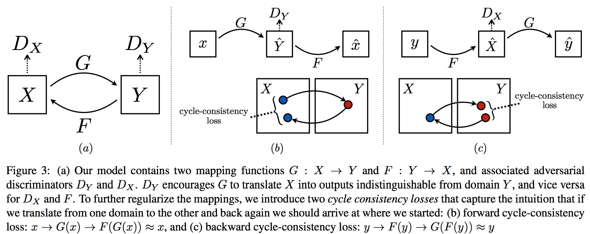
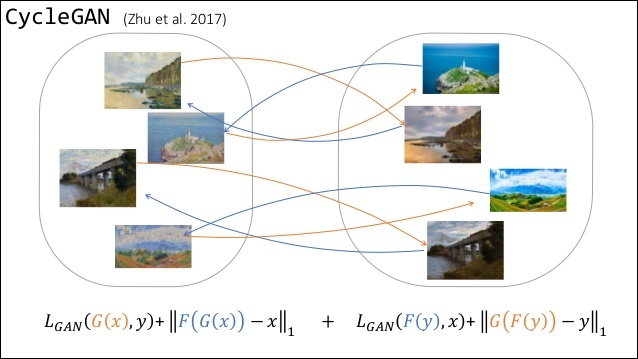

# cycleGAN

- A youtube talk by one of the authors of cycleGAN in Korean [here](https://www.youtube.com/watch?v=Fkqf3dS9Cqw&t=2401s)
    - and its [summary](http://www.kwangsiklee.com/2018/03/cyclegan%EC%9D%B4-%EB%AC%B4%EC%97%87%EC%9D%B8%EC%A7%80-%EC%95%8C%EC%95%84%EB%B3%B4%EC%9E%90/)

- GAN Applications are well summarized in [here](https://github.com/nashory/gans-awesome-applications)

- A tutorial on GAN, pix2pix, CycleGAN is in [microsoft blob](https://www.microsoft.com/developerblog/2017/06/12/learning-image-image-translation-cyclegans/)

- A small scale cycleGAN is [here](https://github.com/yunjey/mnist-svhn-transfer) that transfers between MNIST & SVHN (`32x32` image size)


```{r, echo=FALSE, out.width='100%', fig.align='center', fig.cap='Concept of cycleGAN in the original paper'}

```


```{r, echo=FALSE, out.width='80%', fig.align='center', fig.cap='Another figure showing the directions between two unpaired traing sets.'}

```


```{r, echo=FALSE, out.width='100%', fig.align='center', fig.cap='More illustrative figure for cycleGAN, from [here](https://github.com/yunjey/mnist-svhn-transfer).'}
knitr::include_graphics('figures/cyclegan.png')
```


## Coding with `pytorch`

* If you can make GAN program with `pytorch`, a coding for cycalGAN should not be such difficult.

* The small size cycleGAN in [here](https://github.com/yunjey/mnist-svhn-transfer) is good to follow to get an idea how to it should be programmed. The code there is a little bit out of date due to `pytorch` version up. 

* Then move to the inventor's `pytorch`.


## Small Scale cycleGAN


