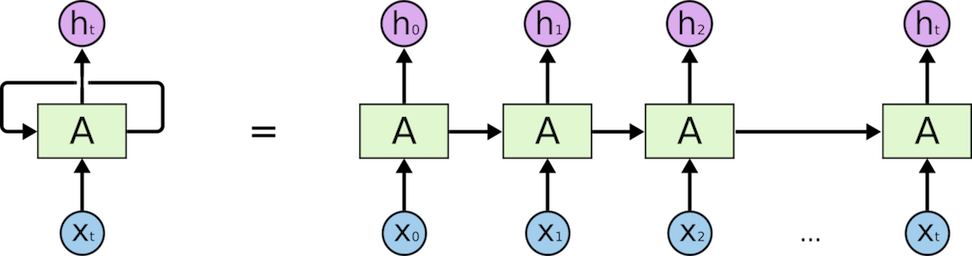

# RNN (Recurrent Neural Network)

Recurrent neural network has a feedback loop. It is a kind of for loop to calculate an accumulation given a list of inputs.

```{r, echo=FALSE, fig.align='center', out.width='95%', fig.cap='RNN and its unrolled version'}

```

- We will use LSTM mainly.

## LSTM

A good illustraiton and explation about LSTM is [here](http://colah.github.io/posts/2015-08-Understanding-LSTMs/), where the following figure comes from.

```{r, echo=FALSE, fig.align='center', fig.cap='LSTM Illustration'}
knitr::include_graphics('figures/LSTM3-var-GRU.png')
```

### LSTM Intro

- How to use `nn.LSTM` layer.
```{python}
import torch
import torch.nn as nn
import torch.nn.functional as F
import torch.optim as optim
import numpy as np

torch.manual_seed(1)
```

```{python}
seq_len = 5
batchsize = 2
feature_dim = 3

lstm=nn.LSTM(input_size=feature_dim, hidden_size=4)
inp = torch.randn(seq_len, batchsize, feature_dim)
```

Remember the `shape` of input data. It is a sequence of mini-batches of features.
```{python}
print ('input data shape (seq_len, batch, feature) = ', inp.shape)
print (inp)
```

Like all other layers in `torch.nn`, `torch.nn.LSTM` is used as a function, and returns two.
```{python}
out, h = lstm (inp)
```

One is the output of `LSTM` and the other is the hidden state that follows the output sequence.
```{python}
print ('output shape (seq_len, batch, hidden_size)', out.shape)
```
```{python}
print ('output:\n', out.data)
```

The second output retruned from `LSTM`, named `hidden`, has two components
```{python}
print ('len(h) = ', len(h), ' h[0] = ', h[0].shape, ' h[1] = ', h[1].shape)
```
This output `h` corresponds to the output of `lstm` for the last item of the input sequence.
```{python}
print ('@ h[0] =\n', h[0], '\n@ h[1] =\n', h[1])
```
The first `h[0]` is the same as the last batch of `out` (you should check it), and `h[1]` is a tensor used inside the `lstm`.

The output `out` was provided from `lstm` after 5 iterations. Why 5? The length of the input seqnece `inp` is of length 5.

We can also iterate this recurrent neural network one by one using a for loop to obtain the same output sequence.

Let's extract one batch of the input sequence.
```{python}
in0 = inp[0]
print (in0, in0.shape)
```
You can see that the dimension of tensor `in0` has one less then `inp`, of course. However, `lstem` expects its input to have 3 dimensions `(seq, batch, feature)`. Since `in0` is a sequence of length 1, we can chage its shape.
```{python}
in00 = in0.reshape(1, *in0.shape)
print (in00, in00.shape)
```
See that the `shape` has one more dimension for time index. The `*` sign is to give all numbers of `in0.shape` to the function `reshape`; so it is equivalent to `reshape(1, in0.shape[0], in0.shape[1])

```{python}
out0, h = lstm (in00);
print (out0, out0.shape)
```
You can compare this output with the first batch shown above. The numbers should all the same. Let's check
```{python}
print (out0[0] - out[0])
```

Next iteration of this RNN requires for you to put `h` as the second argument when you call `lstm`. This is very important!

```{python}
in11 = inp[1].reshape(1, *inp[1].shape)
out1, h = lstm (in11, h);
print (out1[0] - out[1])
```
Note that the output `out1` is all the same as the 1st data contained in `out[1]`. You can repeat this to get the output one by one, or in practice you can change your input to lstm at every time step.

### LSTM Usage

* You feed a sequence data to `LSTM` (initial `h` is 0 by default) then you get a feature vecotor.
* The input sequence's length can be arbitrary.
* The sequence can be a text sentence such as "I am going to" of 4 words. Then `LSTM` may produce `cinema` as its output. If the input is 'the flower in the garden is very much', then the output can be 'beautiful'. The output of LSTM depends wholy on the training texts.
* The input/output of LSTM is not a sequence of words. So, we use instead the sequence of index numbers based on the vocabulary we make before training.
* We might try a random value for initial `h` to cause a small variation. How would it be?


## LSTM for Part-of-Speech Tagging

- see [here](https://pytorch.org/tutorials/beginner/nlp/sequence_models_tutorial.html#sphx-glr-beginner-nlp-sequence-models-tutorial-py)


```{python}
tag2ix = {'det': 0, 'nn': 1, 'v': 2}

training_data = [
    ('the dog ate the apple'.split(), ['det', 'nn', 'v', 'det', 'nn']),
    ('everybody read that book'.split(), ['nn', 'v', 'det', 'nn'])
]

word2ix = {}
for sent, tags in training_data:
    for word in sent:
        if word not in word2ix:
            word2ix[word] = len (word2ix)
#
print ('word2ix=', word2ix)
```

```{python}
EMBEDDING_DIM = 7
HIDDEN_DIM    = 6
#
def prepare_seq (seq, toix):
    idx = [toix[w] for w in seq]
    return torch.tensor (idx, dtype=torch.long)
```

Let us revise how to use `Embedding` and `LSTM` in `pytorch`.

```{python}
sent0, tag0 = training_data[0]
print ('sent0=', sent0, '\ntag0 = ', tag0)
idxseq0 = prepare_seq(sent0, word2ix)
print ('idxseq0=', idxseq0)

nn_emb = nn.Embedding (len(word2ix), EMBEDDING_DIM)
emb = nn_emb(idxseq0)
print ('emb = nn.Embedding({}) = {}\n{}'.format(idxseq0, emb.shape, emb))
#
lstm = nn.LSTM(EMBEDDING_DIM, HIDDEN_DIM)
# remember the input format to LSTM is (time, batch, data)
emb = emb.reshape(emb.shape[0],1,-1)
print ('emb.shape = ', emb.shape)
out, h = lstm (emb)
print ('lstm_out = {}\n{}'.format(out.shape, out))
print ('lstm_h = \n{}'.format(h))
```

Create the model:
```{python}
class LSTMTagger (nn.Module):
    def __init__(self, emb_dim, h_dim, vocabsize, tagsetsize):
        super (LSTMTagger, self).__init__()
        self.h_dim = h_dim
        self.word_embedding = nn.Embedding(vocabsize, emb_dim)
        
        self.lstm = nn.LSTM (emb_dim, h_dim)
        
        self.h2tag = nn.Linear (h_dim, tagsetsize)
        self.h = self.init_hidden()
    #
    def init_hidden(self):
        return (torch.zeros(1,1,self.h_dim), torch.zeros(1,1,self.h_dim))
        
    def forward(self, sent):
        emb = self.word_embedding (sent)
        lstmout, self.h = self.lstm (emb.reshape(emb.shape[0], 1, emb.shape[1]), self.h)
        tag_space = self.h2tag (lstmout.reshape(lstmout.shape[0], lstmout[2]))
        tag_score = F.log_softmax (tag_space, dim=1)
#
```

- This network accepts a sequence of indices (which will be generated from the function `prepare_seq()`). Let's say its length is $N$.
- Then `Embedding` layer will produce a sequence of embedding vectors ($N$, $E$). $E$ is the dimension of embedding.
- The output of `Embeddig` layer is reshaped to the size ($N$, 1, $E$) to be fed into lstm network. Here $1$ is the size of mini-batch.
- The `LSTM` layer produces output `lstmout` whose shape is ($N$, 1, $H$), where $H$ is the size of hidden layers of the `LSTM` or the size of output vectors.
- Then the output `lstmout` is reshaped to ($N$, $H$). This is fed into a `Linear` layer which accepts a tensor of size $H$ and produces a tensor of $T$, tag dimension. The sequence size $N$ plays the role of batch size for this linear layer. The final output has the shape of ($N$, $T$). Each of the $N$ vectors are of shape $T$. The vector of shape $T$ is converted to the likelihood vector for the tag indices through `softmax`.


The rest is the same. 

- define a model, loss, optimizer
- run a training loop
- evaluate the trained model with a set of test data if there is. Otherwise, we can at most do evaluate the model with training data.


## Bi-directional RNN

Bi-directional RNN is composed of two RNNS, one is a normal RNN and the other RNN get the data in the reverse order. Then the output of the two RNN sequences are concatnated. The figure below will be more helpful to understand the mechanism.

```{r, echo=FALSE, fig.align='center', out.width='95%', fig.cap='Bi-directional RNN and its unrolled version(http://colah.github.io/posts/2015-09-NN-Types-FP)'}
knitr::include_graphics('figures/bi-RNN.png')
```

Let's see how `pytorch` implementation works. This time we use `GRU`.
```{python, birnn0}
seq_len = 5
batchsize = 1
feature_dim = 1

bi_grus = nn.GRU(input_size=feature_dim, hidden_size=1, bidirectional=True)
```

To check the output of the reverse part of `bi_grus`,
```{python, birnn1}
reverse_gru = torch.nn.GRU(input_size=1, hidden_size=1,  bidirectional=False)
#
reverse_gru.weight_ih_l0 = bi_grus.weight_ih_l0_reverse
reverse_gru.weight_hh_l0 = bi_grus.weight_hh_l0_reverse
reverse_gru.bias_ih_l0 = bi_grus.bias_ih_l0_reverse
reverse_gru.bias_hh_l0 = bi_grus.bias_hh_l0_reverse
```
we declare a *normal* GRU named as `reverse_gru` and set its weights share the values of those of `bi_grus`

```{python}
input = torch.randn(seq_len, batchsize, feature_dim) # seq, batch, inputsize 
#
bi_out, bi_hidden = bi_grus (input)
#
rev_in = input[np.arange(4,-1,-1),:,:]
#
rev_out, rev_hidden = reverse_gru (rev_in)
```
Notice that we reverse the `input` and give it to `reverse_gru`, whose output should be reversed.
```{python}
print ('bi_out: ', bi_out[:,0,:].data) # the output is 1*2 since it is bi-directional
```

```{python}
print ('rev_out: ', rev_out[:,0,0].data)
```
Check that the `rev_out` is found in the second column in `bi_out` in reversed order.
```{python}
print ('rev_hidden: ', rev_hidden.data)
```
```{python}
print ('bi_hidden:', bi_hidden.data)
```
Conclusion: Bi-directional RNN is just a simple concatation of two RNN's, one in normal direction, the other in reversed direction.

Q. Change `hidden_size` to another value like `2` and see the results.