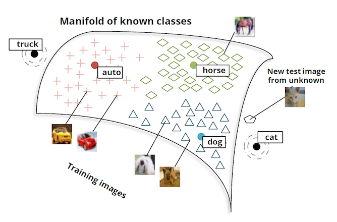

``` {r}
knitr::opts_chunk$set(engine.path = list(
  python='/usr/local/bin/python3'
))
```

# Embedding Extended

- Read [this](http://colah.github.io/posts/2014-07-NLP-RNNs-Representations)

- Various tries to combine word embedding with other data types.

- The figure \@ref(fig:imageClassManifold) is from the 2013 paper [Zero-Shot Learning Through Cross-Modal Transfer
](https://nlp.stanford.edu/~socherr/SocherGanjooManningNg_NIPS2013.pdf)
by Socher, Ganjoo, Manning, and A. Ng.


```{r imageClassManifold, echo=FALSE, fig.align='center', fig.cap='RNN and its unrolled version'}

```
