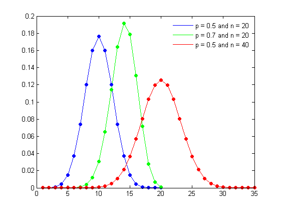
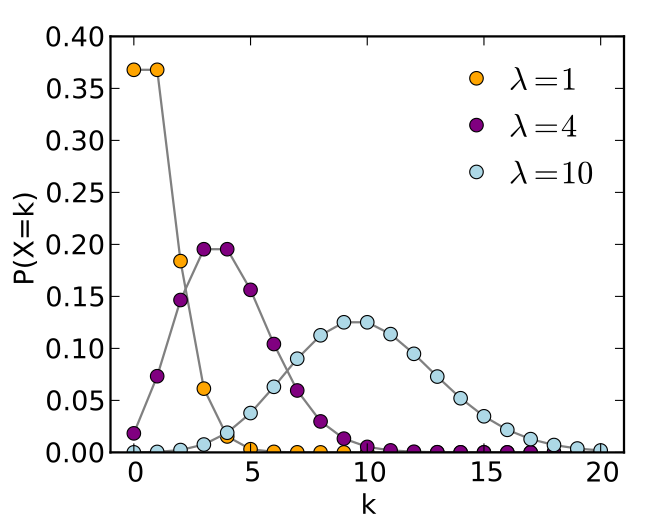
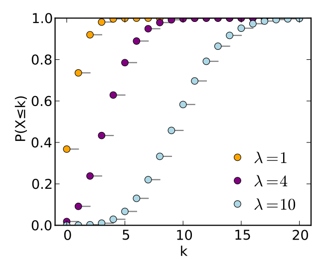
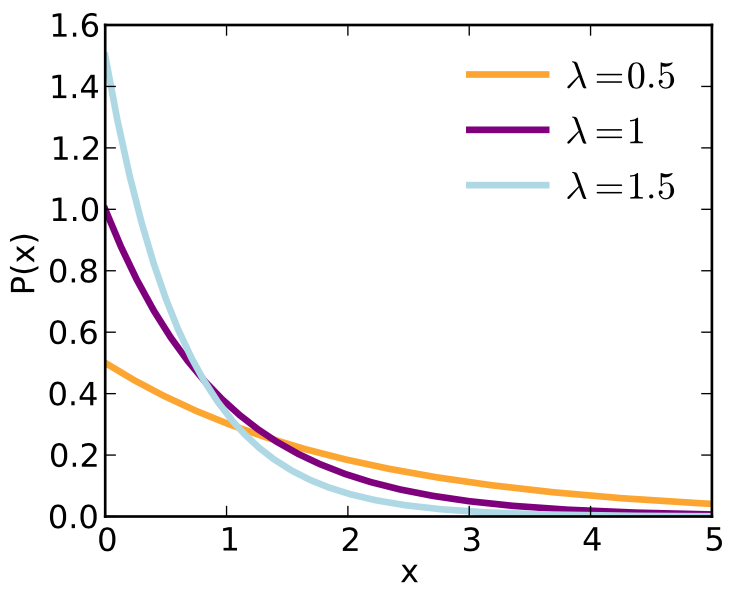
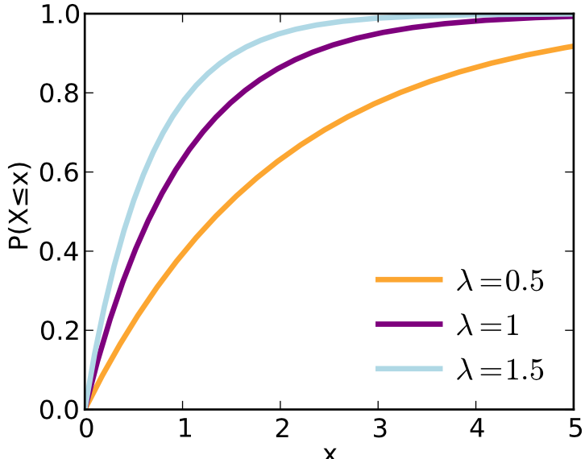

# Keywords from Probability Theory

## Binomial Distribution

- Read [wikipedia](https://en.wikipedia.org/wiki/Binomial_distribution)

- The binomial distribution with parameters $n$ and $p$ is the discrete probability distribution of the number of successes in a sequence of $n$ independent experiments, each asking a yes–no question, and each with its own boolean-valued outcome

- The binomial distribution is frequently used to model the number of successes in a sample of size n drawn with replacement from a population of size N. If the sampling is carried out without replacement, the draws are not independent and so the resulting distribution is a hypergeometric distribution, not a binomial one. However, for N much larger than n, the binomial distribution remains a good approximation, and is widely used.

- When $n=1$, it is also called a Bernoulli distribution.

- The binomial distribution is the basis for the popular binomial test of [statistical significance](https://en.wikipedia.org/wiki/Statistical_significance).

- mean: $\mu = n p$
- std: $\sigma = \sqrt{n p (1-p)}$

### Probability Mass Function (PMF)

- If the random variable $X$ follows the binomial distribution with parameters $n\in N$ and $p\in [0,1]$, we write $X \sim B(n, p)$. 

- The probability of getting exactly $k$ successes in $n$ trials is given by the probability mass function
$$
 Pr(X=k | n, p) = {\binom{n}{k}} p^{k}(1-p)^{n-k} 
$$
for $k = 0, 1, 2, …, n,$ where
\begin{equation}
    {\binom {n}{k}}={\frac {n!}{k!(n-k)!}}
\end{equation}


- When $n$ is large, the distribution looks very similar to Gaussian.

```{r figBinomialPMF, echo=FALSE, fig.align='center', fig.cap='PMFs of Binomial Distributions'}

```

Q. Plot and compare. Draw a binomial (n=20, p = 0.5) PMF and a Gaussian $N(\mu, \sigma)$ to examine the similarity.

Q. When is binomial distribution used in real life? Give an example.


### Game prediction
How many games Arsenal will win in a season? [cite](https://www.quora.com/What-are-some-examples-of-the-binomial-distribution-in-real-life)

- We have a boolean outcome - win or lose.
- The number of Trials $N$ is fixed - 38 games per season.
- The probability $p$ of Arsenal winning a particular game .... we need some (history) data to approximate it. Let's assume the probability of winning a game is $\hat p$ based on some data. (This is the point where Bayesian comes in, but later.)
    - $\mu = 22.15$, $\sigma = 2.15$
    - $\hat p = \mu / 38 = 0.582$
- So, we come up with a binomial distribution with $n=38$ and $p=0.582$.
- Now we can compute the probability of winning 30 games out of 38.
    - $P(k=30) = {\binom{n=38}{k=30}} p^{30}(1-p)^{8}$
- Or we can compute the probability of $P(k >= 25)$, which is
$$
  P(k >= 25) = 1 - P(k<25) = 1 - \sum_{k=0}^{24} P(k)
$$


### References

1. [link](http://sphweb.bumc.bu.edu/otlt/MPH-Modules/BS/BS704_Probability/BS704_Probability7.html)
1. [khan academy](https://www.youtube.com/watch?v=O12yTz_8EOw&feature=youtu.be)

## Poisson RV & Distribution 

- An event can occur 0,1,2, ..., $k$, ..., times in an interval (in a fixed interval).
- The average number of events in an interval is designated $\lambda$.
    - $\lambda$ is called event rate or the rate parameter.
    - $\lambda$ is the average number of events per interval
- The probability of observing $k$ events in the interval is given by the PMF function defined by the following equation:

\begin{equation}
P(k {\text{ events in the interval}})=e^{-\lambda } {\frac {\lambda ^{k}}{k!}}
\end{equation}


PMF of Poisson distribution
```{r PoissonPMF, echo=FALSE, fig.align='center', fig.cap='The horizontal axis is the index $k$, the number of occurrences. λ is the expected number of occurrences, which need not be an integer. The vertical axis is the probability of k occurrences given λ. The function is defined only at integer values of k. The connecting lines are only guides for the eye.'}

```

CDF of Poisson Distribution
```{r PoissonCDF, echo=FALSE, fig.align='center', fig.cap='The horizontal axis is the index k, the number of occurrences. The CDF is discontinuous at the integers of k and flat everywhere else because a variable that is Poisson distributed takes on only integer values.'}

```


We can draw samples from the distribution [scipy.org](https://docs.scipy.org/doc/numpy-1.15.1/reference/generated/numpy.random.poisson.html):

```{python}
import numpy as np
s = np.random.poisson (lam=5, size=10000)
#
import matplotlib.pyplot as plt
count, bins, ignored = plt.hist (s, 14, density=True)
plt.show()
```


The synthetic data generated in the book.
```{python}
import numpy as np
rnd = np.random.RandomState (0)
X_org = rnd.normal (size=(1000,3))
w = rnd.normal (size=3)
#
X = rnd.poisson (10 * np.exp(X_org))
y = np.dot (X_org, w)
print ('X = ', X[:5, 0])
```

Let's see a scatter plot of this data.
```{python}
fig,axscatter = plt.subplots()
axscatter.scatter (X[:,0], y)
plt.show()
```

It shows a dense population around the low values of $X$. Its histogram will show the distribution better.

```{python}
bins = np.bincount(X[:,0])
index = np.arange (len(bins))
fig, ax = plt.subplots()
ax.bar (index, bins)
ax.set_ylabel ('number of appearances/events')
ax.set_xlabel ('value')
plt.show()
```

The scatter plot of the log-transformed data.
```{python}
Xlog = np.log (X + 1)
#
fig, ax = plt.subplots ()
ax.scatter (Xlog[:,0], y)
plt.show()
```

This extends the range of $X$. Its histogram should show this extended domain.

```{python}
fig, ax = plt.subplots()
ax.hist (Xlog[:,0], bins=50)
ax.set_ylabel ('number of appearances/events in log-scale')
ax.set_xlabel ('Range of X in log scale')
plt.show()
```


## Exponential Distribution

- The exponential distribution (also known as the negative exponential distribution) is the probability distribution that describes the **time between events** in a Poisson point process, i.e., a process in which events occur continuously and independently at a constant average rate. [wikipedia](https://en.wikipedia.org/wiki/Exponential_distribution)

- It is a particular case of the **gamma** distribution. 
- It is the continuous analogue of the **geometric distribution**, and it has the key property of being **memoryless**. 
- In addition to being used for the analysis of Poisson point processes it is found in various other contexts.

$$
  p(x; \lambda) = \left\{ 
        \begin{array}{lr} 
        \lambda \exp ( -\lambda x ) & x \geq 0\\
            0 & x < 0
        \end{array} \right.
$$
```{r expPDF, echo=FALSE, out.width='50%', fig.align='center', fig.cap='PDFs of exponential distribution.'}

```

```{r expCDF, echo=FALSE, out.width='50%', fig.align='center', fig.cap='CDFs of exponential distribution.'}

```

- mean: $1/\lambda$
- variance: $1/\lambda^2$


## Geometric Distribution


## The p-value & Hypothesis Test

## F-test

- see [here](https://en.wikipedia.org/wiki/F-test)
- the test statistic has an F-distribution under the null hypothesis.
- Mostly used when comparing statistical models that have been fitted to a data set, in order to identify the model that best fits the population from which the data were sampled.
- A test using the variance ratio, as initially developed by Fisher in 1920s.

**Common examples of F-tests**

- The hypothesis that the means of a given set of normally distributed populations are equal (assuming the same std.) This plays an important role in ANOVA.
- The hypothesis that a proposed regression model fits the data well.
- The hypothesis that a data set in a regression analysis follows the simpler of two proposed linear models that are nested within each other.


**Formula & Calculation**

Regression problems

Consider two models, 1 and 2, where model 1 is 'nested' within model 2. Model 1 is the restricted model, and Model 2 is the unrestricted one. That is, model 1 has p1 parameters, and model 2 has $p_2$ parameters, where $p2 > p1$, and for any choice of parameters in model 1, the same regression curve can be achieved by some choice of the parameters of model 2.

If there are $n$ data points to estimate parameters of both models from, then one can calculate the $F$ statistic, given by

\begin{equation}
F ={\frac  {\left({\frac  {{\text{RSS}}_{1}-{\text{RSS}}_{2}}{p_{2}-p_{1}}}\right)}{\left({\frac  {{\text{RSS}}_{2}}{n-p_{2}}}\right)}},
\end{equation}
where $\text{RSS}_i$ is the residual sum of squares of model $i$. If the regression model has been calculated with weights, then replace $\text{RSS}_i$ with χ2, the weighted sum of squared residuals. 

- Under the null hypothesis that model 2 does not provide a significantly better fit than model 1, $F$ will have an $F$-distribution, with $(p2−p1, n−p2)$ degrees of freedom. 
- The null hypothesis is rejected if the $F$ calculated from the data is greater than the critical value of the $F$-distribution for some desired false-rejection probability (e.g. 0.05). The F-test is a Wald test.


## Feature Selection Methods

-- Good blog [here](https://blog.datadive.net/selecting-good-features-part-i-univariate-selection/)


### ANOVA, Univariate Statistics


## Two Classes

Bayse Theorem:

\begin{equation}
    P(A, B) = P(A|B) P(B) = P(B|A) P(A)
\end{equation}


\begin{equation}
    P(A) = \sum_i P(A, B_i) = \sum_i P(A|B_i) P(B_i)
\end{equation}

\begin{equation}
    P(l | d) = \frac{P(d|l)P(l)}{P(d)} = \frac{P(d|l)P(l)}{\sum_i P(d|l_i) P(l_i)}
\end{equation}

In this case, we have only to classes whose labels are denoted by $L_1$ and $L_2$.

For a two class problem, the posterior probability for class $L=L_1$ given data $d$ can be written as

\begin{eqnarray} 
    P(L_1 | d) 
    & = & \frac{P(d | L_1) P(L_1) }{ P(d|L_1)P(L_1) + P(d|L_2)P(L_2)} \\
    & = & \frac{1}{  1 + \frac{P(d|L_2)P(L_2)}{P(d|L_1)P(L_1)} } \\
    & = & \frac{1 }{ 1 + \exp\left( -\ln \frac{P(d|L_1)P(L_1)}{P(d|L_2)P(L_2)} \right) }
\end{eqnarray}

Let's define the **logistic sigmoid** function $\sigma(z)$ by

\begin{equation}
    \mathrm{sigmoid}(z) = \sigma(z) = \frac{1}{1 + \exp (-z) }
\end{equation}

The {\bf logit} function, the inverse of the logistic sigmoid, is given by

\begin{equation}
    z = \ln \left(\frac{\sigma}{1-\sigma}\right)
\end{equation}

which represents the log of the ratio of probabilities 

\begin{equation}
    z = \ln\frac{P(L_1|d)}{P(L_2|d)} = \ln \frac{P(d|L_1)P(L_1)}{P(d|L_2)P(L_2)}
\end{equation}
for the two classes. This is also known as the {\bf log odds}.

\subsection{Parametrization of Logistic Regression}
Now, let's make a linear model for the log odds:
\begin{equation}
    z = \ln \frac{P(d|L_1)P(L_1)}{P(d|L_2)P(L_2)} = \sum_i w_i f_i + w_0 = \boldsymbol{w}^\top\boldsymbol{f}
\end{equation}
where $f_i$ is $i$-th feature value of the data $d$, $(w_i, w_0)$ are parameters for linear modeling. This model is known as {\bf logistic regression} in the terminology of statistics.

Given data or features, $d = (f_1, ... f_n)$, the probability $P(L_1|d)$ is now written as

\begin{equation}
    \label{eq:likelihood}
    P(L_1 | d) = P(L_1 | f_1, ..., f_n)
     = \frac{1}{1 + \exp\big(-\boldsymbol{w}^\top\boldsymbol{f}\big) } = \mathrm{sigmoid}(\boldsymbol{w}^\top\boldsymbol{f})
\end{equation}

## Problem Solving

It is convenient to use two numbers $0$ and $1$ for the two labels. Data labels in the literature are denoted by the variable $y$; it can have $0$ or $1$.
    
For a sample data $d=\boldsymbol{f}$ having its label $L  = L_1 = 1$, with an appropriate modeling parameter $\boldsymbol{w}$, the likelihood that $L$ or $y$ is $1$ should be 

\begin{align}
        P(L = 1 | d, \boldsymbol{w}) = P(y = 1 | d, \boldsymbol{w}) = \mathrm{sigmoid}(\boldsymbol{w}^\top\boldsymbol{f}) = 1
\end{align}

If the label for the sample data is $y = 0$, 

\begin{align}
        P(L = 0 | d, \boldsymbol{w}) = 1 - P(y = 1 | d, \boldsymbol{w}) = 1 - \mathrm{sigmoid}(\boldsymbol{w}^\top\boldsymbol{f}) = 0
\end{align}

For a data set $\{ d_i, y_i \}$ where $y_i \in \{0, 1\}$ and $i=1,...,N$. The likelihood function can be written
\begin{equation}
        P(y_1,...,y_n | w_0, ..., w_n) = \prod_{i=1}^N p_i^{y_i} (1-p_i)^{1-y_i}
\end{equation}
where $p_i = P(L_i = 1|d_i)$ ($L_i$ is the label for the $i$-th sample data $d_i$).
    
For example, let us suppose that $y = \{1, 1, 0\}$. Then the likelihood is given by
\begin{align}
    P(\boldsymbol{L} = & \{y_1, y_2, y_3\} | \boldsymbol{w}, \boldsymbol{f}_1, \boldsymbol{f}_2, \boldsymbol{f}_3) \\
            & = P(L = y_1 | \boldsymbol{w}, \boldsymbol{f}_1) P(L = y_2 | \boldsymbol{w}, \boldsymbol{f}_2) P(L = y_3 | \boldsymbol{w}, \boldsymbol{f}_3)\\
            & = \sigma(\boldsymbol{w}^\top\boldsymbol{f_1})
            \sigma(\boldsymbol{w}^\top\boldsymbol{f_2})
            \big( 1 - \sigma(\boldsymbol{w}^\top\boldsymbol{f_3}) \big)
\end{align}
    %
If we find the best estimate $\boldsymbol{w}$, then the likelihood will be $1$. So, our goal of optimization is to find a $\hat{\boldsymbol{w}}$ that makes the likelihood as close to $1$ as possible. If a parameter vector $\boldsymbol{w}^*$ maximizes the joint likelihood, then it is called the {\bf maximum likelihood estimate}. When we perform a numerical computation to obtain an estimate, we do not use the formulation in product form given in Equation $\ref{eq:likelihood}$

    
Instead, we define the error function by taking the negative logarithm of the likelihood, which gives the {\bf cross-entropy error function} in the form

\begin{equation}
        E(\boldsymbol{w})
        = -\ln P(\boldsymbol{y} | \boldsymbol{w})
        = -\sum_{n=1}^N \big\{ 
                y_n \ln p_n + (1-y_n)\ln(1-p_n)
                \big\}
\end{equation}

where $p_n = P(L_1|d_n) = \sigma( \boldsymbol{w}^\top \boldsymbol{f}_n)$.
    
## Naive Bayes

**Conditional independence** property:

\begin{equation}
    p(f_1, f_2 | L) = p(f_1 | L) p(f_2 | L)
\end{equation}

The posterior probability is given by

\begin{align}
    p(L_k | f_1, f_2) & = \frac{ p(f_1, f_2 | L_k) p(L_k) }{\sum_i p(f_1,f_2|L_i)p(L_i)}  \\
      & \propto p(f_1, f_2 | L_k) p(L_k) = P(f_1, f_2, L_k)
\end{align}

Using the conditional independence assumption,

\begin{equation}
    P(f_1, f_2, L_k) = p(f_1 | L_k) p(f_2 | L_k) p(L_k) 
\end{equation}

That is, the posterior distribution over the class variable $L_k$ under the conditional independence assumption is given by
\begin{equation}
    p(L_k | f_1, ..., f_n) = \frac{1}{Z} p(L_k) \prod_{i=1}^n p(f_i | L_k)
\end{equation}
where $Z$ is the {\bf evidence}
\begin{equation}
    Z = p(f_1, ..., f_n) = \sum_i p(L_i) p(f_1,...,f_n|L_i)
\end{equation}
which is a scaling factor dependent only on $f_1, ..., f_n$. Note that $Z$ is a constant if the values of the feature variables $f_i$ are known and fixed.

### Problem solving
We choose the $L_k$ that provides maximum joint probability $p(\boldsymbol{f}, L_k)$:
\begin{equation}
    \hat L = \underset{k\in\{1,...,K\}}{\arg\max} \quad p(L_k) \prod_{i=1}^n p(f_i | L_k)
\end{equation}
The class probability $L_k$ can be estimated from the data population, and the feature likelihood $p(f|L_k) $ is modeled based on the characteristics of the features provided for model training.

### Gaussian Naive Bayes
When dealing with continuous data, a typical assumption is that the continuous values associated with each class are distributed according to a Gaussian distribution. For example, suppose the training data contains a continuous attribute, $x$. We first segment the data by the class, and then compute the mean and variance of $x$ in each class. Let $\mu _{k}$ be the mean of the values in $x$ associated with class $C_k$, and let $\sigma _{k}^{2}$ be the variance of the values in $x$ associated with class $C_k$. Suppose we have collected some observation value $f$. Then, the probability distribution of $f$ given a class $C_{k}$,  $p(x=f | C_{k})$, can be computed by plugging $f$ into the equation for a Normal distribution parameterized by $\mu _{k}$ and $\sigma _{k}^{2}$ [wikipedia]

\begin{equation}
            p(x = f | L_k) = \frac{1}{(2\pi\sigma^2)^{1/2}} \exp\left[ -\frac{ (f-\mu_k)^2}{2\sigma_k^2}\right]
\end{equation}
        
### Multinomial naive Bayes
With a multinomial event model, samples (feature vectors) represent the frequencies with which certain events have been generated by a multinomial $(p_1, \dots, p_n)$ where $p_{i}$ is the probability that event $i$ occurs (or K such multinomials in the multiclass case). A feature vector ${\mathbf  {x}}=(x_{1},\dots ,x_{n})$ is then a histogram, with $x_{i}$ counting the number of times event $i$ was observed in a particular instance. This is the event model typically used for document classification, with events representing the occurrence of a word in a single document (see bag of words assumption). The likelihood of observing a histogram $\mathbf x$ is given by

\begin{equation}
{p(\mathbf {x} \mid C_{k})={\frac {(\sum _{i}x_{i})!}{\prod _{i}x_{i}!}}\prod _{i}{p_{ki}}^{x_{i}}} 
\end{equation}

The multinomial naive Bayes classifier becomes a linear classifier when expressed in log-space:[2]
\begin{equation}
    \begin{aligned}
        \log p(C_{k}\mid \mathbf {x} )
            &\varpropto \log\left(p(C_{k})\prod_{i=1}^{n}{p_{ki}}^{x_{i}}\right) \\
        &=\log p(C_{k})+\sum _{i=1}^{n}x_{i}\cdot \log p_{ki} \\
        &=b_k+\mathbf {w} _{k}^{\top }\mathbf {x} 
    \end{aligned} 
\end{equation}

where 
$b_k=\log p(C_{k})$ and $w_{{ki}}=\log p_{{ki}}$  (with constraints $b_k \leq 0$ and $w_{ki} \leq 0$ since $0\leq p \leq 1$).

%
Given the learned parameters $b_k$ and $\mathbf{w}_k$, for each class, the posterior probability for the label $L_k$ (or classs $C_k$) of a feature vector $\mathbf x$ whose label is not known  is computed by the following two steps:

1. compute the probability, unnormalized:
        \begin{equation}
            p(C_k | \mathbf x) = \exp \big[ b_k + \mathbf{w}_k^\top \mathbf x \big]
        \end{equation}
2. normalization:
    \begin{equation} 
        p(C_k | \mathbf x) = p(C_k | \mathbf x) \bigg/ \sum_i p(C_i|\mathbf x).
    \end{equation}
This operation is actually the same as the {\bf softmax} operation in neural networks.

If a given class and feature value never occur together in the training data, then the frequency-based probability estimate will be zero. This is problematic because it will wipe out all information in the other probabilities when they are multiplied. Therefore, it is often desirable to incorporate a small-sample correction, called pseudocount, in all probability estimates such that no probability is ever set to be exactly zero. This way of regularizing naive Bayes is called Laplace smoothing when the pseudocount is one, and Lidstone smoothing in the general case.


[**Maximum Likelihood Estimator of parameters of multinomial distribution**](https://math.stackexchange.com/questions/421105/maximum-likelihood-estimator-of-parameters-of-multinomial-distribution)


### Bernoulli naive Bayes

\begin{equation}
            p(f_1,...,f_n) = \prod_{i=1}^n p^{f_i}_{ki} (1-p_{ki})^{(1-f_i)}
\end{equation}
where $f_i$ is a boolean variable expressing the occurrence or absence of the $i$-th feature from the feature vocabulary, and $p_{ki}$ is the probability of class $L_k$ generating the feature $f_i$. The probability $p_{ki}$ must be learned before inference.


* https://en.wikipedia.org/wiki/Naive_Bayes_classifier

* Bishop, Pattern Recognition and Machine Learning, Springer 2006.
